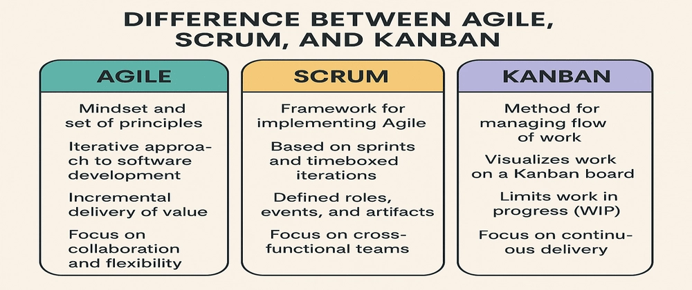

---
hide:
    - toc
---
# Session 0 — Agile Foundations & Tool Setup (Slack + Taiga + GitHub)

!!! info "Format"
    **2h theory + 2h lab** · Team size: 10 (each team = a mini‑company inside **TechOps Inc.**)  
    Tools: Slack, Taiga, GitHub · Output: Working Slack workspace + Taiga project + Sprint‑1 plan + Team repo

---

## Objectives
- Explain **Agile values & principles**, and the differences between **Scrum** and **Kanban** in the context of IT Infrastructure & DevOps.
- Set up **team collaboration** tools: Slack (ChatOps) and Taiga (Agile project management).
- Create a **syllabus‑mapped backlog** and plan **Sprint 1** (Sessions 6–9).
- Establish **working agreements**, roles, and a **definition of done (DoD)** for the team.
- Prepare a **GitHub team repo** structure that will be used throughout the course.

---

## Theory Summary (Agile for Infra & DevOps) 
Agile emerged to counter rigid, plan‑heavy delivery models that struggled with uncertainty. In Dev and Ops contexts, Agile is less about speed for its own sake and more about **short feedback loops**, **visibility**, and **continuous improvement**. We’ll use Agile to coordinate complex work across infrastructure, cloud, and DevOps pipelines.

**Agile values** emphasize individuals & interactions, working solutions, customer collaboration, and responsiveness to change. In our setting, “customer” = your stakeholders: internal teams, instructors, and demo audiences. **Principles** like frequent delivery, technical excellence, and sustainable pace map well to infrastructure work: small increments (e.g., baseline VM image), validated frequently (checkpoints), and continuously improved (automation).

**Scrum** fits when you have a well‑defined increment and cadence: plan a **sprint** (2–3 weeks), hold a **daily stand‑up** (async in Slack), and aim for a **potentially shippable increment** (e.g., Infra Blueprint by Session 9). Roles are flexible here: a **Project Lead** plays Scrum Master‑like facilitation; the **Instructor** is close to Product Owner; the team is the **cross‑functional developers** (DevOps, Cloud, Security, Monitoring, Storage/Network).

**Kanban** suits ongoing ops (tickets, incidents, enhancements). You’ll use Kanban columns (To Do → In Progress → Review → Done) with **WIP limits** to prevent overload while doing labs and hardening.

In DevOps culture, **ChatOps** (tooling + conversation) turns Slack into the central nervous system: GitHub PRs, Jenkins builds, monitoring alerts, and Taiga updates surface in channels so decision‑making is transparent and fast. **Taiga** anchors planning and tracking: epics for phases (Infra, Cloud, DevOps, CI/CD, Security/HA), stories for sessions, and tasks for lab steps. Your **Definition of Done** ensures quality (docs/screenshots/automation checked in, peer review done, Taiga story moved to Done, Slack summary posted).

Key benefits you’ll feel immediately:
- **Visibility**: everyone sees who’s doing what, what’s blocked, and what’s next.  
- **Traceability**: each lab deliverable ties to a Taiga story and a GitHub PR.  
- **Incremental progress**: you’ll produce checkpoints that layer into the final demo.

---

## Agile

Agile is a way of working that delivers value **in small, useful slices**, learning from feedback quickly, and adapting plans as we go. Instead of locking a big plan for months, Agile asks:  
**“What’s the next most valuable thing we can deliver in the next short cycle?”**

**Core ideas**
- Deliver in **small batches** (1–2 week cycles).
- Focus on **customer/stakeholder value**.
- Gather **fast feedback** and adapt.
- Encourage **collaboration** across teams.
- **Respond to change** instead of resisting it.

!!! example "Everyday Example"
    You’re building a college fest website.  
    - Week 1: deliver the **schedule page**.  
    - Week 2: add **speaker bios**.  
    - Week 3: add **ticketing**.  
    After week 1, you learn most users are on **mobile**, so you adjust next week’s plan to improve mobile experience.  
    → That’s Agile: deliver → learn → adjust.


---

## Agile Methodologies: Scrum and Kanban

Agile is the philosophy. **Scrum** and **Kanban** are two popular ways to implement it.

### Scrum (time-boxed approach)
- **Sprints:** Short, fixed-length cycles (1–3 weeks).
- **Roles:**  
  - Product Owner (sets priorities)  
  - Scrum Master (facilitates, removes blockers)  
  - Development Team (does the work)
- **Events:** Sprint Planning, Daily Stand-ups, Sprint Review, Retrospective.
- **Artifacts:** Product Backlog, Sprint Backlog, Increment.

!!! example "Scrum Example"
    A team promises: “In 2 weeks, we’ll deliver a **baseline VM image**.”  
    - They sync daily for 15 min.  
    - At sprint end, they demo the VM and get feedback: “please add curl and htop.”  
    - Next sprint, they adjust accordingly.

---

### Kanban (flow-based approach)
- **Visualize work** on a board (To Do → In Progress → Done).
- **Limit Work-In-Progress (WIP)** to avoid multitasking chaos.
- **Measure flow**: cycle time (start to finish), throughput (items/week).

!!! example "Kanban Example"
    An ops team gets requests: create users, patch servers, rotate keys.  
    - They allow only **3 tasks max** “In Progress”.  
    - When one finishes, they **pull** the next.  
    → Result: fewer half-done tasks, faster average completion.

---

### Scrum vs Kanban (at a glance)

| Scrum | Kanban |
|-------|--------|
| Works in **fixed sprints** | Works in **continuous flow** |
| Team **commits to a sprint goal** | Team **pulls tasks as capacity frees** |
| Best for project-style work | Best for ongoing ops/support |



---

## Lean

Lean focuses on **maximizing value while eliminating waste**.  
Originating in Toyota’s production system, it maps perfectly to IT and DevOps.

**Three enemies in Lean**
- **Muda (Waste)** – unnecessary work, delays, rework.
- **Mura (Unevenness)** – workload peaks/valleys causing churn.
- **Muri (Overburden)** – overloading people/systems.

**Five Lean Principles**
1. Specify value (from customer’s viewpoint).  
2. Map the value stream (all steps from request → delivery).  
3. Create flow (remove bottlenecks and stops).  
4. Establish pull (work only when demand exists).  
5. Seek perfection (continuous improvement).

**Common wastes in IT/DevOps**
- Waiting (e.g., PR sits 3 days unreviewed).  
- Rework (build breaks due to inconsistent environments).  
- Overprocessing (writing 30-page docs no one reads).  
- Overproduction (building features/scripts nobody uses).  
- Inventory/WIP (10 half-done tasks, nothing delivered).  
- Motion/context switching (jumping across 6 tools).  
- Unused talent (infra engineers excluded from design).

---

## Implementation of Lean (DevOps context)

1. **Define value** clearly (e.g., “a secure, ready-to-use VM by Friday”).
2. **Map the value stream** (all steps request → running system).
3. **Measure baseline** (lead time, cycle time, MTTR).
4. **Remove waste** (standard templates, automation, smaller batches).
5. **Introduce pull** (WIP limits, visualize queues).
6. **Make problems visible** (dashboards, blocked items).
7. **Continuous improvement** (small retrospectives after each delivery).

!!! example "Mini Case"
    Goal: Deliver a **sandbox VM** in 48 hours.  
    - Old: approval wait 2 days + manual provisioning → often rework.  
    - Lean: pre-approved hardened template + self-service request.  
    → Delivery in hours, fewer defects, happier devs.

---

## Lean and Agile in DevOps

- **Agile** = what to build next (short cycles, priorities).  
- **Lean** = how to deliver efficiently (cut waste, improve flow).  
- **DevOps** = culture + automation bridging Dev & Ops.

**Practical intersections**
- Agile sprints + Lean small batches → **CI/CD pipelines**.  
- Lean “reduce handoffs” + Agile “cross-functional teams” → fewer silos.  
- Limit WIP + short sprints → steadier throughput.  
- Retrospectives (Agile) + Kaizen (Lean) → continuous improvement.

**DevOps practices showing Lean + Agile**
- Small PRs + trunk-based development.  
- Automated testing & deployments.  
- Infrastructure as Code (standardization).  
- Feature flags (safe incremental releases).  
- Observability (metrics, logs, traces → faster recovery).  

!!! example "Real-world Outcome"
    A team moves from monthly deployments to **twice a week** by:  
    - Using Agile sprints (1 feature/week).  
    - Applying Lean (limit WIP, automate tests).  
    Result: smaller, safer deployments, faster recovery, less stress.

---

## Key Takeaways

- Agile = **deliver value in small increments, adapt quickly**.  
- Scrum = **structured sprints**, Kanban = **continuous flow**.  
- Lean = **maximize value, eliminate waste**.  
- Lean + Agile = **DevOps culture**, powered by automation and feedback.  

---

## Practical Application (TechOps Inc. Simulation)
**Scenario:** You’ve just joined TechOps Inc. as a 10‑person platform team. You have four weeks to deliver the first milestone: **Infra Blueprint** (Sessions 6–9). Today you will create your **communication hub**, **project board**, **repo**, and a **working plan** for Sprint‑1.

---

## Lab Guide (2h)

### A. Slack Workspace (ChatOps) — 25 min
1. Create or join the course Slack workspace.  
2. Create channels:
   - `#announcements` (read‑only for instructors)
   - `#helpdesk` (Q&A with instructors)
   - `#team-<company-name>` (private team channel)
   - Optional cross‑team: `#devops`, `#cloud`, `#storage`, `#monitoring`
3. Add integrations (you can wire these fully in later sessions):
   - **GitHub**: repo notifications to `#team-<company-name>`
   - **Taiga**: story updates → `#team-<company-name>`
4. Pin a **Team Charter** (copy, edit, and post):
   - Team name, members & roles (Cloud Architect, SysAdmin, DevOps x2, Developers x2, Security, Monitoring, Storage/Network, Project Lead)
   - Working hours, response times
   - Stand‑up time (async template: *Yesterday / Today / Blockers*)
   - Definition of Done (see template below)

**DoD template (pin this):**
- Code/config committed with README and comments  
- Steps reproducible; credentials redacted; screenshots added  
- PR raised & reviewed by ≥1 peer  
- Taiga story moved to **Done** with link to PR and short summary  
- Slack update posted (`#team-...`): what changed, who reviews, where to test

---

### B. Taiga Project — 35 min
1. Create a **Taiga project**: *TechOps Inc. – Company <X>*  
2. Create **Epics** (map to course phases):
   - Infra Foundations (S6–S9)
   - Virtualization & Cloud (S10–S13)
   - DevOps Foundations (S14–S17)
   - CI/CD & Monitoring (S18–S20)
   - Security & HA (S21–S23)
3. Create **User Stories** for Sprint‑1 (Sessions 6–9). Suggested set:
   - S6: Baseline VM image (Linux/Windows), snapshot strategy
   - S7: Data center layout & constraints doc
   - S8: NAS (TrueNAS CORE) for team file sharing
   - S9: SAN (iSCSI) for VM cluster
4. Break stories into **Tasks** (examples):
   - Download Ubuntu LTS ISO; create VM (2 vCPU/4GB/40GB)
   - Install base packages + updates; create `baseline-v1` snapshot
   - Deploy TrueNAS VM; configure share; test from team VM
   - Configure iSCSI target; connect initiator; validate block storage
5. Add **Definition of Done** at project level (and link to the Slack post).
6. Set **Sprint‑1** dates (cover S6–S9 timeline); assign story owners; estimate points.

*(Optional) CSV import: you can prepare a CSV of stories/tasks to import into Taiga if you prefer. Keep a copy in `docs/assets/taiga-backlog/`.*

---

### C. GitHub Team Repo — 35 min
1. Create a repo (private or internal): `techops-<company-name>`.
2. Add this **starter structure**:
```
├── infra/
│ ├── vm-baseline/
│ ├── nas-truenas/
│ └── san-iscsi/
├── cloud/
├── app/
├── cicd/
├── monitoring/
├── security/
└── docs/
├── lab-notes/
└── diagrams/
```
3. Add a **root README.md** with:
- Team roster & roles
- How to clone & run labs
- Links to Slack channel & Taiga board
4. Create a **`docs/lab-notes/session-06.md`** file and add checklists for VM setup.
5. Set up **branch protection** (require PR review by at least one teammate).
6. Connect **GitHub → Slack** notifications to your team channel.

---

### D. Sprint Planning — 25 min
1. **Capacity**: note each member’s realistic hours for the sprint.
2. **Prioritize** stories for S6–S9; split if too big (aim for 1–3 days per story).
3. **Assign** owners; confirm acceptance criteria align with DoD.
4. Add **risk/assumption** notes: ISO availability, network limits, hardware quotas.
5. Post the **Sprint plan** summary in Slack and pin it.

---

## Checkpoints (end of session)
- [ ] Slack workspace & **team channel** ready; Team Charter pinned  
- [ ] **Taiga project** created with Epics, Stories (S6–S9), Tasks, Sprint‑1 dates  
- [ ] **GitHub repo** created with agreed folder structure + initial README  
- [ ] **Definition of Done** documented and referenced in both Slack & Taiga  
- [ ] Sprint‑1 plan posted in Slack (owner per story + acceptance criteria)

---

## Quick Quiz (knowledge check)
??? question "Which Agile practice best ensures visibility of daily progress and blockers?"
 - [x] Daily stand‑ups (async in Slack)
 - [ ] Quarterly release planning
 - [ ] Post‑mortems only after failures
 - [ ] Annual performance reviews

??? question "In this course, who is closest to the Product Owner role?"
 - [x] Instructor (defining outcomes & acceptance)
 - [ ] Security Engineer
 - [ ] Project Lead
 - [ ] Cloud Architect

??? question "What belongs in our Definition of Done (pick all that apply)?"
 - [x] Reproducible steps & docs in repo
 - [x] PR reviewed by a teammate
 - [x] Taiga story moved to Done with links
 - [ ] Only a verbal confirmation in class

---

## Deliverables (to be graded)
1. **Slack**: Link to team channel + pinned Team Charter & DoD  
2. **Taiga**: Project URL + screenshot of Sprint‑1 board  
3. **GitHub**: Repo URL + screenshot of repo structure  
4. **Sprint‑1 plan**: Short note in Slack with owners & dates

---

## References/Self Study (YouTube / Slides)
You can drop these into this page later:

<!-- YouTube -->
<iframe width="560" height="315"
src="https://www.youtube.com/watch?v=8eVXTyIZ1Hs" title="What is Agile?"
frameborder="0" allow="accelerometer; autoplay; clipboard-write; encrypted-media; gyroscope; picture-in-picture"
allowfullscreen></iframe>

<!-- Google Slides -->
<iframe src="https://docs.google.com/presentation/d/e/2PACX-1vTJD-RrXIv5pqfOiBOhCRZ_d6VPoxiInWXIO2d0_mdNSPCTH3ERofzOLyLsQhii0UC1kO99N-qQzEMO/pubembed?start=false&loop=false&delayms=3000" frameborder="0" width="960" height="569" allowfullscreen="true" mozallowfullscreen="true" webkitallowfullscreen="true"></iframe>
