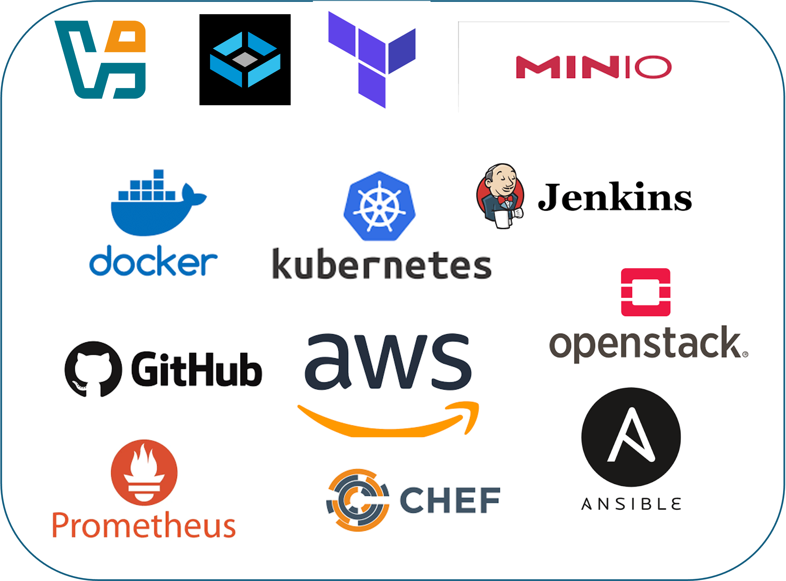

---
hide:
  - toc
  - navigation
# IT Infrastructure & DevOps — PG‑DITISS Aug 2025
---
# 🚀 PG-DITISS: IT Infrastructure & DevOps  

---

## 🌐 About the Course
The **Post Graduate Diploma in IT Infrastructure & Systems Security (PG-DITISS)** blends **theory, labs, and real-world simulations** to prepare you for the rapidly evolving world of **cloud, data centers, and DevOps practices**.  

Think of this course not as a classroom, but as your onboarding at **TechOps Inc.** – a fictional tech company where you’ll play the role of a **DevOps Engineer, Cloud Architect, or System Administrator**. You’ll solve real challenges, build scalable systems, and automate workflows — just like in industry.

---

## 🎯 What You’ll Learn
- How to **design, manage, and secure data centers**.  
- The power of **virtualization, SANs, and cloud platforms**.  
- Hands-on **DevOps tools**: Git, Jenkins, Docker, Kubernetes, Terraform, Ansible.  
- Building **CI/CD pipelines** and deploying **microservices at scale**.  
- Automating infrastructure and monitoring systems like an enterprise pro.  

---

## 🏗️ Course Structure

The course is structured into **3 Phases + Foundation**. Each phase includes **theory + labs** (2–6 hours per module) and culminates in checkpoints that mimic **real workplace reviews**.

### 📖 Foundation (Phase 0) – *Agile & DevOps Mindset*
- Agile, Scrum, Kanban, Lean Thinking.  
- Slack, Jira, GitHub onboarding.  
- Labs: Team collaboration, backlog creation, Kanban workflows.  

---

### 🏢 Phase 1 – *Data Center Management*
- Data center architecture, power, cooling, networks, and site selection.  
- Infrastructure: cabling, WAN links, NOC operations, servers, and DR planning.  
- Security: physical, logical, and internet-level protections.  
- Labs: Design a data center for **TechOps Inc.** with budget and resilience constraints.  

---

### ☁️ Phase 2 – *Virtualization & Cloud*
- Virtualization concepts, hypervisors, and clusters.  
- SAN design and high availability labs.  
- Cloud computing with OpenStack, AWS, Azure, GCP.  
- Labs: Deploy VMs, configure SAN, launch EC2 instances, simulate cloud migration, set up monitoring.  

---

### ⚡ Phase 3 – *DevOps*
- DevOps lifecycle and culture.  
- Git, Jenkins, Docker, Kubernetes basics → advanced orchestration.  
- Infrastructure as Code with Terraform.  
- Microservices deployment and automation with Ansible.  
- Labs: End-to-end CI/CD pipeline, Terraform infra, Kubernetes microservices, Ansible playbooks.  

---

## 🎮 Course Experience
- **Simulation**: You’re part of *TechOps Inc.* — every lab is a mission.  
- **Gamification**: Earn badges for completing sprints, solving outages, or optimizing deployments.  
- **Collaboration**: Work in squads, review each other’s code, and submit via GitHub PRs.  
- **Evaluation**:  
  - 40% Theory Exam  
  - 40% Lab Exam  
  - 20% Internal Assessment (sprints, checkpoints, peer reviews)  

---

## 🛠️ Tools You’ll Use
- VirtualBox, FreeNAS (TrueNAS CORE), MinIO.  
- AWS Free Tier, Azure for Students, OpenStack.  
- Docker, Kubernetes (Minikube).  
- Jenkins, GitHub Actions, Terraform, Ansible.  
- Nagios, Prometheus.  
- Ansible, Chef

---

## 🌟 Why This Course Stands Out
- **Hands-on first**: Every session ties to a lab.  
- **Industry workflows**: GitHub repos, CI/CD pipelines, team retrospectives.  
- **Career-ready skills**: Everything you do here mirrors **real DevOps engineer roles**.  
- **Innovation focus**: Learn not just to use tools, but to design and optimize infrastructure.  

---

## 📌 Next Steps
- Start with **[Syllabus](../docs/roadmap/syllabus.md)** for a detailed breakdown.  
- Join the Slack workspace and set up your Jira board (see Phase 0 Lab 00).  
- Clone the starter GitHub repo and get ready to push your first PR.  

Welcome aboard, Engineer. **Your first sprint at TechOps Inc. begins now.** 🚀

