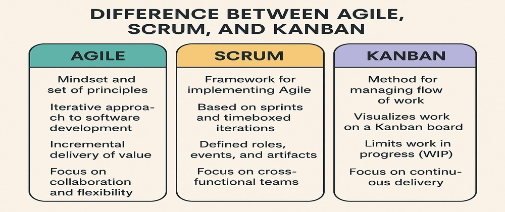

---
hide:
    - toc
---
## Agile Methodologies: Scrum and Kanban

Agile is the philosophy. **Scrum** and **Kanban** are two popular ways to implement it.

### Scrum (time-boxed approach)
- **Sprints:** Short, fixed-length cycles (1–3 weeks).

- **Roles:**  

    - Product Owner (sets priorities)  
    - Scrum Master (facilitates, removes blockers)  
    - Development Team (does the work)

- **Events:** Sprint Planning, Daily Stand-ups, Sprint Review, Retrospective.
- **Artifacts:** Product Backlog, Sprint Backlog, Increment.

!!! example "Scrum Example"
    A team promises: “In 2 weeks, we’ll deliver a **baseline VM image**.”  
    - They sync daily for 15 min.  
    - At sprint end, they demo the VM and get feedback: “please add curl and htop.”  
    - Next sprint, they adjust accordingly.

---

### Kanban (flow-based approach)
- **Visualize work** on a board (To Do → In Progress → Done).
- **Limit Work-In-Progress (WIP)** to avoid multitasking chaos.
- **Measure flow**: cycle time (start to finish), throughput (items/week).

!!! example "Kanban Example"
    An ops team gets requests: create users, patch servers, rotate keys.  

      - They allow only **3 tasks max** “In Progress”.  
      - When one finishes, they **pull** the next.  
      → Result: fewer half-done tasks, faster average completion.

---

### Scrum vs Kanban (at a glance)

| Scrum | Kanban |
|-------|--------|
| Works in **fixed sprints** | Works in **continuous flow** |
| Team **commits to a sprint goal** | Team **pulls tasks as capacity frees** |
| Best for project-style work | Best for ongoing ops/support |

---