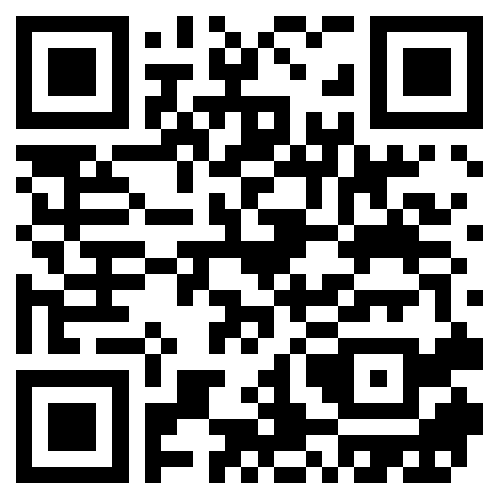

# Phase 0 - Agile Mindset Knowledge Check

It's time to assess your understanding of the topics covered in Phase 0: Agile Mindset and ChatOps. Please follow the steps below to take the exam:

1. Scan the provided QR code or visit the designated link to register for the exam (if you haven't already).
2. Locate the exam titled **"Phase 0 - Checkpoint"**.
3. The exam will be unlocked by the instructor once all students are ready.

**QR Code for Exam System:**

**Link for Exam System:**

<a href="https://skarkhanis95.pythonanywhere.com/" target="_blank">Exam System </a>

Ensure you are prepared to demonstrate your knowledge. Good luck!