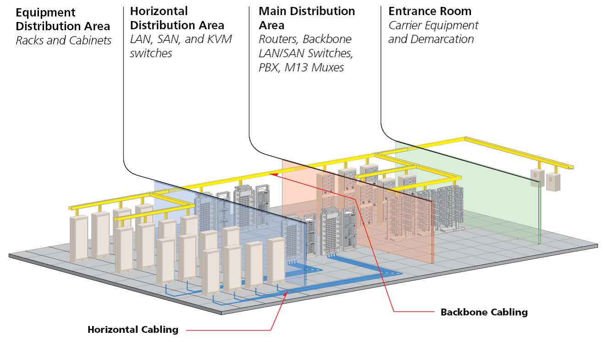
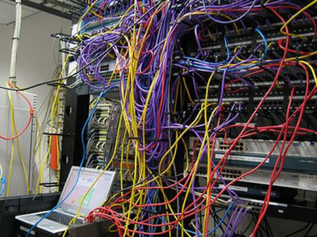
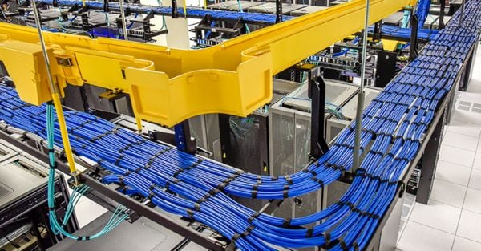
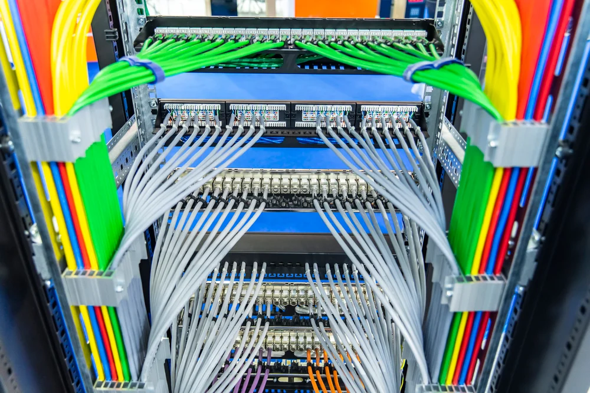

---
hide:
    - toc
---
# Modular Cabling Design

## 1. What is it?
Modular cabling design means organizing all the cables in a data center in a structured, repeatable way so that adding new servers or making changes doesn’t create a tangled mess. It uses zones and standardized components so the system is neat, easy to expand, and easy to troubleshoot.

## 2. Theoretical Definition
Structured cabling is a standardized approach to data center cabling defined by TIA/EIA-568 standards. It divides the cabling system into zones and uses modular, interchangeable parts like patch panels, racks, and fiber optic modules to ensure scalability and flexibility.

## 3. Why is it important?
- Reduces downtime (easy to replace or add connections).
- Makes troubleshooting simple (clear labeling and layout).
- Future-proofs the data center (easy to add faster connections like 40/100 Gbps fiber).
- Saves costs in the long run (less rework, less mess).

## 4. How is it planned?
In structured cabling, the data center is divided into zones:

- **MDA (Main Distribution Area)**

    - Think of this as the **“nerve center”** of the data center.
    - All core network equipment like main switches, routers, and backbone cables are located here.
    - It connects to the **outside world (ISP/WAN)** and distributes traffic internally.

- **HDA (Horizontal Distribution Area)**

    - Imagine this as the “floor manager”.
    - Located on each row or section of server racks.
    - Contains switches and patch panels that connect to the servers in that area.

- **ZDA (Zone Distribution Area)**

    - Acts like a “local breakout box”.
    - It’s an optional area between HDA and the servers.
    - Used when you need flexibility for frequent changes — for example, in cloud providers who add/remove servers all the time.

- **Other components used:**

    - **Patch Panels** → Boards where multiple cables plug in; makes it easy to rearrange connections without touching the main cables.
    - **Fiber Optics** → High-speed cables (instead of copper) used for backbone connections.
    - **Standardized Connectors** → Like using the same type of plugs everywhere (RJ45, LC, SC) so you don’t get compatibility issues.

## 5. Impact if not done correctly

- Cable clutter leading to accidental disconnections.
- Hard to track which server is connected where → longer downtime.
- Increased costs for upgrades or maintenance.
- Poor airflow because of messy cables → overheating issues.

## 6. Real World Example
At Facebook’s **Prineville Data Center (Oregon, USA)**, engineers use structured cabling zones so they can add thousands of new servers every year without interrupting existing operations. They rely heavily on fiber optics in the backbone (MDA) and patch panels in HDA to manage growth.

## Examples of Good Cabling

**HDA Cabling:**

**Rack Cabling:**

