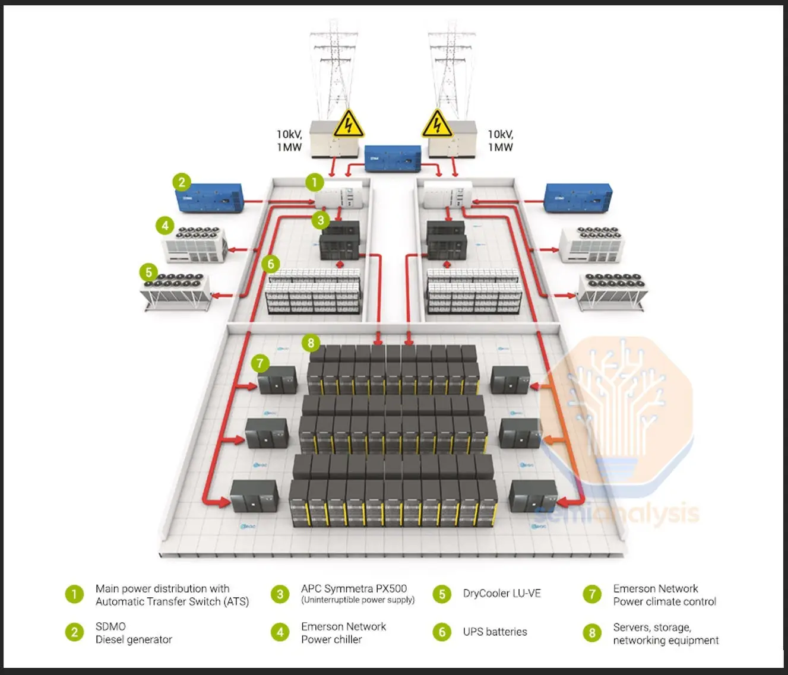

# Points of Distribution (PoD)

## 1. What is it?  
In a data center, **Points of Distribution (PoD)** are the **structured layers** where network cabling and devices are logically grouped.  
Think of them as **checkpoints** or **junctions** where cables come together and are distributed to the next level.  
This design makes the network scalable, organized, and easier to manage.

---

## 2. Theoretical Definition  
The Telecommunications Industry Association (TIA) defines distribution points in structured cabling standards.  
They divide the data center network into **hierarchical layers** that handle traffic at different scales:  

- **MDA (Main Distribution Area)** → The central hub where core routers, main switches, and backbone connections live.  
- **IDA (Intermediate Distribution Area)** → The middle layer (optional) that helps when the data center is very large.  
- **HDA (Horizontal Distribution Area)** → The distribution points closer to server racks; usually houses access switches.  
- **EDA (Equipment Distribution Area)** → The endpoints — where servers, storage, and user devices are connected.  

---

## 3. Why is it important?  
- Ensures data flows smoothly from **core (MDA)** to **servers (EDA)**.  
- Reduces network congestion by spreading load across layers.  
- Makes troubleshooting easier (you know at which “layer” a problem exists).  
- Provides redundancy — if one path fails, another can take over.  
- Supports modular scaling: just add more PoDs when expanding.  

---

## 4. How is it planned?  

A simple way to understand the PoD hierarchy:  

- **Main Distribution Area (MDA)**  

    - The **“brain”** of the data center.  
    - Contains the core routers, firewalls, and main patch panels.  
    - Connects to external ISPs and WAN links.  

- **Intermediate Distribution Area (IDA)** (used in large data centers)  
  
    - The **“regional office”** between the brain and the floor-level switches.  
    - Helps reduce long cable runs by splitting traffic regionally.  

- **Horizontal Distribution Area (HDA)**  
    - The **“floor manager”** for a row of server racks.  
    - Contains access switches and patch panels that connect to equipment in that area.  

- **Equipment Distribution Area (EDA)**  
    - The **“end users”** of the system — servers, storage, and application hardware.  
    - The final point where devices plug into the network.
  
!!! info "📌 **Design Tip**"
    In smaller data centers, IDA might be skipped, but MDA → HDA → EDA is always present.  

---

## 5. Impact if not done correctly  

- Too many devices connected directly to core switches → bottlenecks and downtime.  
- Difficult to trace faults → longer MTTR (Mean Time to Repair).  
- Poor scalability — adding new racks means running new long cables instead of plugging into local HDAs.  
- Higher costs in cable management and cooling.  

---

## 6. Real World Example  
At **Equinix Data Centers**, the **Point of Distribution design** is key to their **colocation services**.  
- MDA connects clients to global internet backbones.  
- HDA distributes connections to each customer’s cage/rack.  
- EDA connects to client servers.  

This modular design allows Equinix to onboard new clients quickly while keeping latency low and ensuring uptime.  

---

👉 Easy Analogy:  
- **MDA = Airport hub** (international flights).  
- **IDA = Regional airports** (optional).  
- **HDA = City airports**.  
- **EDA = Your neighborhood taxi stand** (final destination).  

