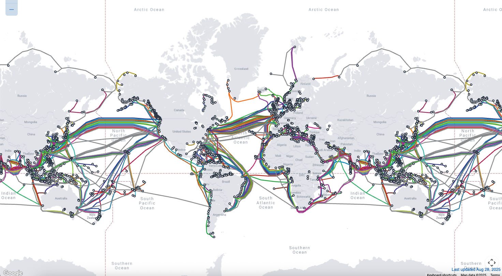

# ISP Network Infrastructure and WAN Links

## 1. What is it?  
This refers to the **external connectivity** of a data center — how it connects to the internet, other data centers, and remote branch offices.  
It is provided by **Internet Service Providers (ISPs)** through high-speed **Wide Area Network (WAN)** links.  
Without this, a data center would only be a local island, not accessible to users or other sites.

---

## 2. Theoretical Definition  
- **ISP Network Infrastructure** → The collection of physical cables (fiber optic cables, undersea cables, satellite links), routers, and switches that deliver internet services.  
- **WAN (Wide Area Network) Links** → High-capacity connections (leased lines, MPLS, SD-WAN) that extend connectivity beyond the local data center to branch offices, cloud services, and end-users.  

These links are designed for **high availability, low latency, and redundancy**.

---

## 3. Why is it important?  
- Provides access to cloud platforms (AWS, Azure, Google Cloud).  
- Enables remote employees and branch offices to connect securely.  
- Supports business continuity by ensuring always-on connectivity.  
- Allows hosting of websites, apps, and services that are publicly reachable.  
- Critical for disaster recovery (DR) sites that must synchronize data across regions.  

---

## 4. How is it planned?  

When planning ISP and WAN connectivity, data centers consider:  

- **Redundancy** → Using at least **two ISPs** with separate physical paths so one failure doesn’t cause downtime.  
- **Bandwidth** → Calculated based on expected traffic (e.g., number of users, applications, backup requirements).  
- **Technology Choices**:  

    - **Leased Lines** → Dedicated fiber between the data center and ISP, guaranteed bandwidth.  
    - **MPLS (Multiprotocol Label Switching)** → Secure private WAN service, often used by banks and enterprises.  
    - **SD-WAN (Software-Defined WAN)** → Modern approach that uses internet connections intelligently to balance cost and performance.  
    - 
- **Service Level Agreements (SLAs)** → ISPs guarantee uptime, latency, and support response times.  
- **Security** → Firewalls, VPNs, and DDoS protection at the ISP edge.  

---

## 5. Impact if not done correctly  
- **Single point of failure**: If only one ISP is used, downtime could last hours or days.  
- **Poor user experience**: Slow applications and websites due to lack of bandwidth.  
- **Business losses**: E-commerce, financial services, and streaming platforms could lose millions during outages.  
- **Security risks**: Insecure WAN links could allow man-in-the-middle attacks or data leaks.  

---

## 6. Real World Example  
- **Amazon Web Services (AWS)** builds **redundant WAN links** across regions to provide **low-latency global services**.  
- For example, AWS India (Mumbai region) connects via **undersea fiber optic cables** to Singapore and Europe.  
- Enterprises like **banks** often use **MPLS WAN links** for secure financial transactions, while startups may use **SD-WAN** for cost savings.  

---

## 7. Live Sea Cable Map

Below is the screenshot showing current network of sea cables laied world wide. [Click here to dig in more](https://www.submarinecablemap.com/){: target="blank" }

👉 Easy Analogy:  
- **ISP = Highway system** that connects your city (data center) to the rest of the world.  
- **WAN Links = The express lanes** (leased lines, MPLS, SD-WAN) that guarantee faster, more reliable travel than public roads.  
- **Redundancy = Having two highways** so even if one is blocked, traffic still flows.  
