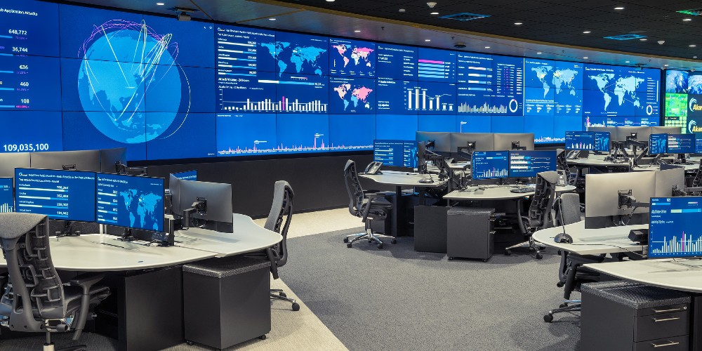

---
hide:
    - toc
---

# Network Operations Center (NOC) and Monitoring

## 1. What is it?  
A **Network Operations Center (NOC)** is the **command center** of a data center or IT organization.  
It’s a dedicated space (often a large room with screens and monitoring tools) where IT staff track the health of servers, networks, applications, and security in real-time.  

**Monitoring** is the continuous process of collecting, analyzing, and acting on data about the infrastructure to ensure everything is running smoothly.

---

## 2. Theoretical Definition  
- **NOC** → A centralized facility where network engineers and administrators monitor and manage network traffic, server uptime, application performance, and security events.  
- **Monitoring** → The systematic use of tools and software (like Nagios, Prometheus, Zabbix, or SolarWinds) to detect problems before they impact end-users.  

---

## 3. Why is it important?  
- Ensures **24/7 availability** of business-critical systems.  
- Detects outages or cyberattacks early (reducing downtime).  
- Improves performance by spotting bottlenecks before they affect users.  
- Provides centralized visibility across multiple data centers or offices.  
- Supports compliance with SLAs (Service Level Agreements).  

---

## 4. How is it planned?  

When setting up a NOC and monitoring strategy:  

- **Physical NOC Setup**  

    - Large display walls showing dashboards (traffic load, alerts, security events).  
    - Staffed by teams working in shifts to provide 24/7 coverage.  

- **Monitoring Tools**
  
    - **Infrastructure Monitoring** → CPU, memory, disk usage, network throughput.  
    - **Application Monitoring** → Response times, API failures, error rates.  
    - **Security Monitoring** → Intrusion detection, firewall logs, suspicious traffic.  
    - **User Experience Monitoring** → Simulating end-user actions to check service quality.  

- **Alerting & Escalation**  
  
    - Automated alerts via email, SMS, or Slack when an issue occurs.  
    - Escalation process (Level 1 → Level 2 → Level 3 engineers).  

- **Redundancy**  

    - Secondary NOC in another region (Global NOC) to continue operations in case the primary fails.  

---

## 5. Impact if not done correctly  
- Problems go unnoticed → extended downtime.  
- Customers may experience outages without IT knowing about it.  
- SLA violations leading to **financial penalties**.  
- Security breaches (like ransomware or DDoS attacks) might go undetected.  
- Loss of reputation and customer trust.  

---

## 6. Real World Example  
- **Google’s Site Reliability Engineering (SRE) teams** act as a global NOC. They monitor millions of servers across continents using automation and dashboards.  
- **Telecom companies (e.g., AT&T, Reliance Jio)** operate large NOCs to monitor internet backbone traffic, ensuring uninterrupted mobile and broadband services.  
- A **bank** might use a NOC to monitor ATM networks, online banking, and fraud detection systems in real-time.  

---

👉 Easy Analogy:  
- Think of a **NOC like an airport control tower**.  
- Controllers (NOC engineers) constantly watch planes (servers, apps, networks) to ensure smooth take-offs and landings (service delivery).  
- If one plane goes off course (a server fails), they act immediately to prevent accidents (outages).  
