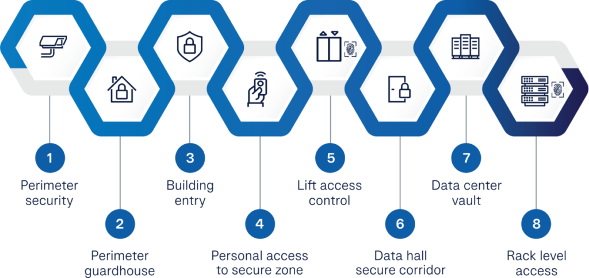

---
hide:
    - toc
---

# Data Center Physical Security, Logical Security, and Cleaning

## 1. What is it?  
A data center is not only about servers and cables—it’s also about **keeping them safe**.  
Security in a data center has two main aspects:  

- **Physical Security** → Protecting the building and equipment from unauthorized entry, theft, or environmental hazards.  
- **Logical Security** → Protecting the data and systems from hackers, malware, or unauthorized digital access.  
- **Cleaning & Maintenance** → Keeping the environment dust-free, controlled, and well-maintained to prevent hardware damage.  

---

## 2. Theoretical Definition  
- **Physical Security**: Layered defenses including fencing, biometric access, CCTV surveillance, fire suppression, and climate control systems.  
- **Logical Security**: Cybersecurity practices like access controls, encryption, intrusion detection, and secure network design.  
- **Cleaning & Maintenance**: Regular dust removal, airflow optimization (hot/cold aisles), and proper cable management to ensure longevity and uptime.  

---

## 3. Why is it important?  
- Protects sensitive business and customer data.  
- Prevents outages due to equipment failures or environmental issues.  
- Ensures compliance with standards like **ISO 27001, PCI-DSS, and HIPAA**.  
- Builds customer trust by guaranteeing confidentiality, integrity, and availability of data.  

---

## 4. How is it planned?

- **Physical Security Layers**  
  
    - Perimeter fencing, guards, biometric access (fingerprint/iris scanners).  
    - CCTV monitoring and motion detectors.  
    - Locked server racks and cages.  

- **Logical Security Measures**  

    - Role-based access controls (only authorized personnel can access certain systems).  
    - Firewalls, IDS/IPS (Intrusion Detection/Prevention Systems).  
    - Multi-factor authentication (MFA) for admin access.  
    - VPNs for secure remote connectivity.  

- **Cleaning & Maintenance Strategy**  

    - Regular anti-static cleaning of server rooms and floors.  
    - Monitoring HVAC (Heating, Ventilation, Air Conditioning) systems.  
    - Proper hot aisle/cold aisle containment for airflow.  
    - Cable management to avoid clutter and overheating.  

---

## 5. Impact if not done correctly  
- **Physical Security Lapses** → Unauthorized entry leading to theft or sabotage.  
- **Logical Security Weaknesses** → Hackers gaining access to sensitive systems.  
- **Poor Cleaning Practices** → Dust clogging fans → overheating → downtime.  
- **Regulatory Non-Compliance** → Heavy fines and legal action.  

---

## 6. Real World Example  
- **Microsoft Azure Data Centers** use multi-layer biometric authentication, CCTV, and secure cages.  
- A **major bank in India** faced a shutdown when dust clogged air filters, showing how poor cleaning can cause downtime.  
- The **Equinix global data centers** showcase physical + logical + environmental security in a single framework.  

---

👉 Easy Analogy:  
- **Physical Security** = Locks, guards, and CCTV for your home.  
- **Logical Security** = Passwords, firewalls, and antivirus on your Wi-Fi.  
- **Cleaning** = Regular dusting and AC maintenance to keep your electronics running smoothly.  
