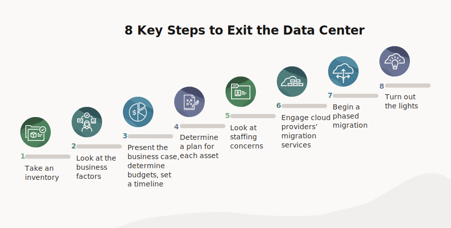

---
hide:
    - toc
---

# Consolidation Opportunities

## 1. What is it?  
**Consolidation opportunities** are the specific areas within a data center or IT environment where systems and processes can be merged or streamlined to save costs, reduce complexity, and improve efficiency.  
It’s about identifying **“where can we combine resources without losing performance?”**

---

## 2. Theoretical Definition  
Consolidation opportunities are the **target points in infrastructure, applications, and operations** that can be optimized or merged through techniques like **virtualization, shared storage, cloud migration, or network simplification**.  

---

## 3. Why is it important?  
- **Cost Reduction** → Fewer servers, licenses, and support costs.  
- **Energy Savings** → Less power and cooling required.  
- **Simplified Operations** → IT staff manage fewer systems with centralized tools.  
- **Agility** → Faster provisioning and scaling when infrastructure is streamlined.  
- **Security and Compliance** → Fewer systems = fewer attack surfaces and easier audits.  

---

## 4. How is it planned?  

Key areas to look for consolidation:  

- **Server Consolidation**  

    - Virtualize workloads on fewer physical servers.  
    - Example: 50 physical servers consolidated into 5 high-capacity hosts.  

- **Storage Consolidation**  
  
    - Replace scattered storage devices with centralized **SAN (Storage Area Network)** or **NAS (Network Attached Storage)** solutions.  
    - Improves reliability and backup management.  

- **Network Consolidation**  
  
    - Simplify multiple switches and routers into fewer, high-capacity devices.  
    - Implement **SDN (Software-Defined Networking)** for centralized management.  

- **Application Consolidation**  

    - Eliminate duplicate or redundant applications.  
    - Use enterprise-wide platforms like ERP or CRM instead of multiple departmental tools.  

- **Data Center Facility Consolidation**  

    - Close smaller server rooms or local data centers, move workloads to a central facility or cloud.  

---

## 5. Impact if not done correctly  
- **Overloading** → Too many workloads on too few systems.  
- **Single Point of Failure** → If redundancy isn’t designed in, one failure can take everything down.  
- **Compatibility Issues** → Applications may not work well when merged.  
- **Hidden Costs** → Migration costs can offset savings if not planned carefully.  

---

## 6. Real World Example  
- **VMware customers** have successfully consolidated hundreds of physical servers into a handful of virtualized hosts, reducing costs by up to 70%.  
- **Netflix** moved from physical data centers to AWS cloud infrastructure, consolidating IT resources globally.  

---

👉 Easy Analogy:  
Think of a household with **10 different refrigerators** in separate rooms. Each consumes power but is half empty.  
By consolidating into **one large refrigerator**, you save electricity, manage food better, and free up space.  
