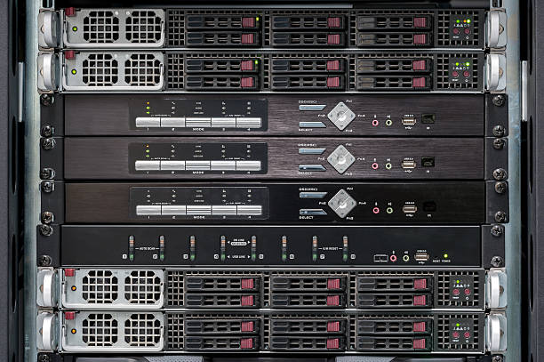
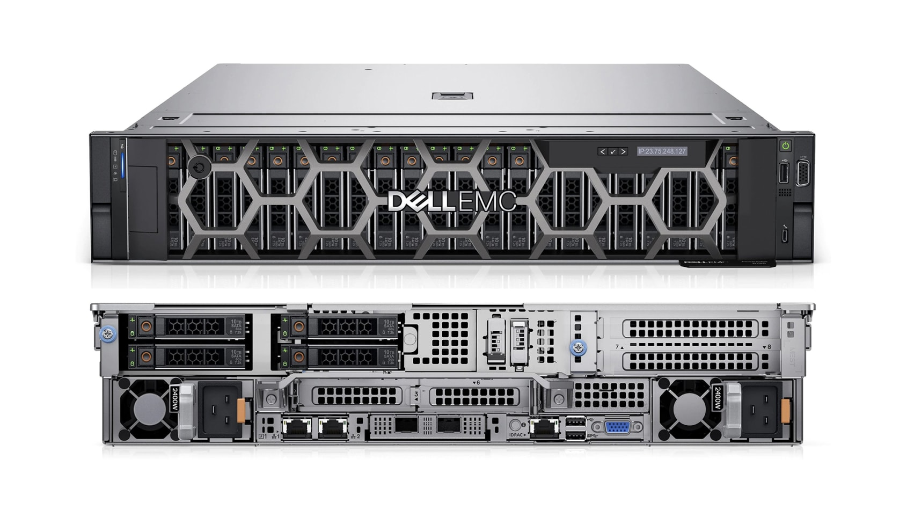

---
hide:
    - toc
---

# Datacenter Servers

## 1. What is it?  
Servers are the **core computing machines** inside a data center.  
They process data, run applications, host websites, and provide storage and network services.  
Without servers, a data center is just an empty building with cables.  

---

## 2. Theoretical Definition  
A **server** is a specialized computer system designed to provide services, applications, or resources to other systems (clients) over a network.  
They are optimized for **performance, reliability, and scalability**, unlike personal desktops.  

Types of servers commonly found in data centers:  
- **Rack Servers** → Standalone units mounted in racks (1U, 2U form factors).  
- **Blade Servers** → Slim modules that fit into a chassis, sharing power and cooling.  
- **Tower Servers** → Standalone cabinet-like servers (less common in large data centers).  
- **Hyperconverged Servers** → Combine compute + storage + networking in a single appliance.  

---

## 3. Why is it important?  
- **Run Business-Critical Applications** → Databases, ERP systems, web applications.  
- **Store and Process Data** → From customer records to analytics workloads.  
- **Enable Virtualization** → Multiple virtual machines (VMs) can run on one physical server.  
- **Support Cloud Infrastructure** → Cloud providers rely on large clusters of powerful servers.  

---

## 4. How is it planned?  
- **Server Form Factor** → Decide whether to use rack, blade, or hyperconverged depending on density and workload.  
- **Performance Requirements** → CPU (cores, speed), RAM (capacity), and storage type (SSD/HDD).  
- **Redundancy** → N+1 design (extra server capacity to handle failures).  
- **Cooling & Power** → Ensure sufficient power supply and airflow for high-density racks.  
- **Scalability** → Design clusters that can scale horizontally by adding more servers.  

---

## 5. Impact if not done correctly  
- **Underpowered Servers** → Slow applications, poor user experience.  
- **Overprovisioned Servers** → Wasted costs on unused capacity.  
- **Single Points of Failure** → Outage if redundancy isn’t planned.  
- **Inefficient Layout** → Poor cooling and higher electricity bills.  

---

## 6. Real World Example  
- **Google** designs custom servers optimized for performance and energy efficiency.  
- **Facebook’s Open Compute Project (OCP)** builds open-standard servers for scalability and lower costs.  
- A **bank’s data center** may use blade servers for transaction processing, while a **cloud provider** like AWS uses hyperconverged and rack servers in clusters.  

---

👉 Easy Analogy:  
Think of servers as the **kitchen of a restaurant**:  
- They prepare (process) and serve (deliver) food (data/applications).  
- The type of kitchen setup (rack, blade, hyperconverged) depends on the restaurant’s size and demand.  
