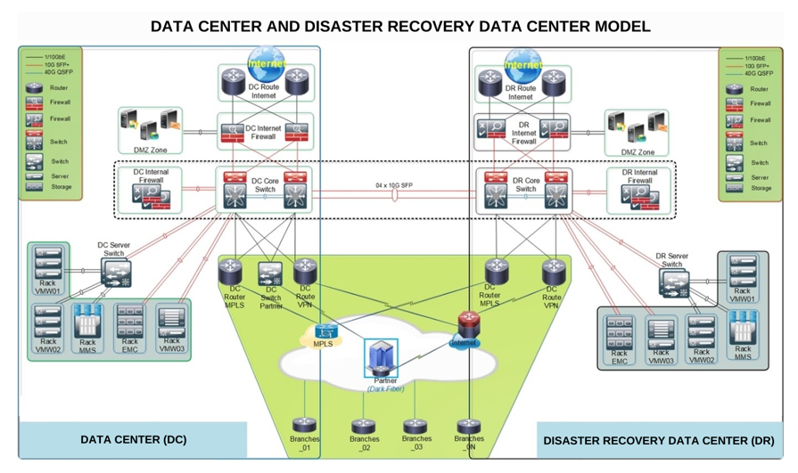

---
hide:
    - toc
---

# Disaster Recovery (DR)

## 1. What is it?  
**Disaster Recovery (DR)** is the set of strategies, tools, and processes that ensure IT systems and data can be restored quickly after a disaster—whether it’s a cyberattack, hardware failure, natural disaster, or human error.  
It’s about **getting business back online with minimal disruption**.  

---

## 2. Theoretical Definition  
Disaster Recovery is a subset of **Business Continuity Planning (BCP)** focused specifically on **restoring IT systems and data**.  

Key terms:  
- **RTO (Recovery Time Objective)** → Maximum acceptable time to restore systems after a failure.  
- **RPO (Recovery Point Objective)** → Maximum acceptable amount of data loss measured in time (e.g., last 15 minutes).  

---

## 3. Why is it important?  
- Prevents extended business downtime.  
- Protects against catastrophic data loss.  
- Ensures compliance with industry standards (e.g., PCI-DSS, HIPAA).  
- Maintains customer trust and brand reputation.  
- Avoids financial penalties due to SLA violations.  

---

## 4. How is it planned?  

- **Risk Assessment**  
  - Identify possible threats: fire, flood, ransomware, hardware failure.  

- **Define Critical Systems**  
  - Prioritize applications and data that must be recovered first.  

- **Backup & Replication**  
  - On-site backups, off-site backups, and cloud-based replication.  
  - Use snapshots and continuous data replication for critical workloads.  

- **Failover Strategies**  
  - **Hot Site** → Fully operational backup site, ready instantly.  
  - **Warm Site** → Partially prepared site, takes hours to activate.  
  - **Cold Site** → Empty site with space/power, requires manual setup.  

- **Testing & Drills**  
  - Regularly simulate disasters to ensure recovery plans actually work.  

---

## 5. Impact if not done correctly  
- Extended downtime → business halts, lost revenue.  
- Permanent data loss if backups fail.  
- SLA violations and regulatory fines.  
- Loss of customer confidence and market share.  

---

## 6. Real World Example  
- **Delta Airlines (2016)** experienced a data center power failure, grounding flights worldwide for days, costing ~$150M.  
- **Sony Pictures (2014)** cyberattack caused massive data loss and system outages.  
- **AWS** provides customers with DR services using multiple regions and availability zones for failover.  

---

👉 Easy Analogy:  
Disaster Recovery is like having a **spare tire in your car**:  
- If you get a flat (server crash), the spare lets you keep going.  
- Without it, you’re stranded until help arrives (business downtime).  
