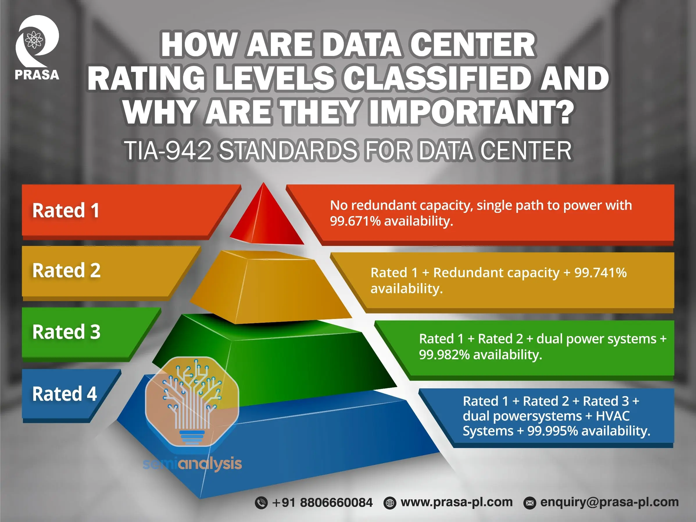

---
hide:
    - toc
---
# Data Center Ratings & Classifications

---

## What is it?
Data centers are classified by **tiers and standards** to define their **reliability, redundancy, and uptime guarantees**.  
These ratings help organizations decide what level of infrastructure they need based on **cost vs reliability**.

---

## Theoretical Definition
The **Uptime Institute Tier Classification** and **TIA-942 Standard** are globally recognized frameworks:  
- They measure **availability**, **redundancy**, and **fault tolerance**.  
- Higher tiers = more resilient, but also more expensive.  

---

## Why is it Important?
- Businesses must match **IT criticality** with the right data center tier.  
- Banks, healthcare, and cloud providers need **higher tiers** (near 100% uptime).  
- Small companies may balance costs with lower tiers.  

---

## Classifications (Uptime Institute Tiers)

### Tier I — Basic Capacity
- **Definition:** Non-redundant capacity components (single path for power/cooling).  
- **Uptime:** 99.671% (~28.8 hours downtime/year).  
- **Use Case:** Small businesses, test environments.  
- **Example:** A startup hosting dev servers with minimal redundancy.

---

### Tier II — Redundant Capacity
- **Definition:** Redundant components (N+1), but only one path for power/cooling.  
- **Uptime:** 99.741% (~22 hours downtime/year).  
- **Use Case:** SMEs needing some resilience.  
- **Example:** Regional data center with backup UPS and generators.

---

### Tier III — Concurrently Maintainable
- **Definition:** Multiple power/cooling paths; only one active at a time; components can be maintained without downtime.  
- **Uptime:** 99.982% (~1.6 hours downtime/year).  
- **Use Case:** Enterprises, banks, e-commerce.  
- **Example:** Most colocation data centers.  

---

### Tier IV — Fault Tolerant
- **Definition:** Multiple active power/cooling paths; redundant systems (2N+1); can sustain one failure without downtime.  
- **Uptime:** 99.995% (~26 minutes downtime/year).  
- **Use Case:** Mission-critical (stock exchanges, global cloud).  
- **Example:** Hyperscale providers (AWS, Google, Microsoft Azure).  

---

## TIA-942 Classification
The **Telecommunications Infrastructure Standard for Data Centers (TIA-942)** defines four **Rating levels** (similar to Uptime Tiers).  
It covers **telecommunications, cabling, redundancy, and physical requirements**.

- **Rated 1:** Basic site infrastructure, single path, non-redundant.  
- **Rated 2:** Redundant capacity components, single path.  
- **Rated 3:** Concurrently maintainable, multiple paths (one active).  
- **Rated 4:** Fault tolerant, multiple active paths, fully redundant.  

---

## How is it Planned?
- Assess **business needs** (cost of downtime, compliance).  
- Select tier/rating accordingly.  
- Design with required **redundancy levels** (power, cooling, network).  
- Certification by Uptime Institute or TIA-942 auditors.

---

## How Can it Impact Down the Line?
- Lower tier = cheaper but higher downtime risk.  
- Higher tier = resilient but higher CAPEX/OPEX.  
- Wrong choice → either wasted money or business outages.  

---

## Real World Examples
- **Tier I:** Small office server rooms.  
- **Tier II:** Local colocation providers in small cities.  
- **Tier III:** Equinix, Digital Realty enterprise-grade facilities.  
- **Tier IV:** Google, AWS, Microsoft Azure hyperscale facilities with global fault tolerance.

---

## DC Ratings in nutshell

# ✅ Key Takeaways
- Data center ratings (Uptime Tiers & TIA-942) define **availability, redundancy, and resilience**.  
- Businesses must align **criticality vs cost** when choosing a data center tier.  
- Tier III is common for enterprises; Tier IV is essential for hyperscale and mission-critical industries.
