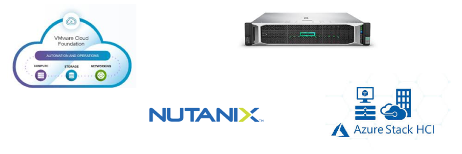

---
hide:
    - toc
---

# Hyper-Converged Infrastructure (HCI)

---

## What is HCI?

### What is it?
**Hyper-Converged Infrastructure (HCI)** is an IT architecture that integrates **compute, storage, and networking** into a single software-driven system. Unlike traditional data centers where these components are managed separately, HCI combines them into a **unified, virtualized environment** managed through a single platform.

In simple terms:
Instead of having separate servers, storage arrays, and networking gear, HCI puts everything into one cluster of servers, managed centrally, and optimized by software.

---

## Theoretical Definition
HCI is a **software-defined IT infrastructure** that tightly integrates compute (virtualized servers), storage (software-defined storage), and networking (virtual switches and SDN) on commodity x86 hardware, with centralized management.

Key characteristics:

- **Software-defined**: The intelligence is in the software, not the hardware.
- **Integrated management**: A single dashboard to manage compute, storage, and networking.
- **Scale-out design**: Add more nodes to increase capacity/performance.

---

## Evolution: From Traditional Infrastructure to HCI

- **Traditional Infrastructure (3-tier architecture):**

    - Separate compute (servers), storage (SAN/NAS), and networking (switches).
    - Complex to deploy and manage.
    - Expensive proprietary hardware.

- **Converged Infrastructure (CI):**

    - Bundled servers, storage, and networking in pre-validated racks.
    - Still separate layers, but tested together.

- **Hyper-Converged Infrastructure (HCI):**

    - Compute, storage, networking **all in software**.
    - Runs on commodity servers.
    - Managed from one platform.

---

## HCI vs Cloud Computing

| Feature                | Hyper-Converged Infrastructure (HCI)          | Cloud Computing                               |
|-------------------------|-----------------------------------------------|-----------------------------------------------|
| **Definition**         | On-premises system integrating compute, storage, and networking in one platform | Delivery of IT services (compute, storage, apps) over the internet |
| **Deployment**         | Runs on physical hardware in your data center | Runs on shared infrastructure owned by cloud provider |
| **Ownership**          | Owned and managed by the organization         | Owned and managed by provider (AWS, Azure, GCP) |
| **Scalability**        | Scale-out by adding nodes                     | Virtually unlimited scalability across regions |
| **Management**         | Centralized, software-defined, local control  | Provider-managed, accessed via APIs/portals   |
| **Cost Model**         | Capital expense (CapEx) + ongoing maintenance | Operational expense (OpEx), pay-as-you-go     |
| **Use Case**           | Private clouds, VDI, on-prem workloads        | Public-facing apps, global scalability        |

👉 Think of **HCI as a private cloud enabler** — it brings cloud-like agility to on-premises infrastructure.

---

## HCI Architecture

### Core Components
1. **Compute**  
   
    - Runs on commodity x86 servers with hypervisors (VMware ESXi, Hyper-V, KVM).
    - Virtual machines (VMs) or containers run applications.

2. **Storage (SDS – Software-Defined Storage)** 
 
    - Local disks (SSD/HDD) across nodes are pooled into a distributed storage system.
    - Features: deduplication, compression, snapshots, replication.

3. **Networking (SDN – Software-Defined Networking)**  
   
    - Virtual networking inside the cluster.
    - Integration with physical switches for external connectivity.

4. **Management Layer**  

    - Centralized dashboard to provision, monitor, and scale resources.
    - API-driven for automation.

---

## Key Benefits of HCI

- **Simplicity**: Single platform for compute, storage, and networking.
- **Scalability**: Add nodes easily as demand grows.
- **Cost Efficiency**: Uses commodity hardware instead of expensive SAN/NAS.
- **High Availability**: Built-in redundancy and fault tolerance.
- **Cloud-like Agility**: Self-service provisioning and automation.
- **Data Services**: Snapshots, replication, backup, disaster recovery.

---

## Leading HCI Vendors
- **VMware vSAN (VMware Cloud Foundation)** – Industry leader, integrates with vSphere.
- **Nutanix** – Pioneer of HCI, software-focused solution.
- **HPE SimpliVity** – Hardware + software appliance.
- **Cisco HyperFlex** – Cisco’s HCI solution with UCS servers.
- **Microsoft Azure Stack HCI** – Hybrid cloud integration with Azure.
- **Dell EMC VxRail** – Joint solution with VMware, popular in enterprises.

---

## Real-World Use Cases
1. **Virtual Desktop Infrastructure (VDI)**  
   HCI simplifies scaling hundreds of virtual desktops for enterprises.

2. **Private Cloud Deployment**  
   Organizations use HCI as the foundation for private clouds.

3. **Remote & Branch Offices (ROBO)**  
   HCI appliances are compact, easy to deploy, and perfect for branches.

4. **Backup & Disaster Recovery**  
   Built-in replication and failover ensure business continuity.

5. **Dev/Test Environments**  
   Fast provisioning of isolated environments for developers.

---

## Examples
- A **university** uses HCI for hosting e-learning systems and student portals on a private cloud.  
- A **bank** runs its core banking applications on Nutanix HCI to reduce reliance on expensive SANs.  
- An **e-commerce company** uses VMware vSAN for hybrid cloud workloads, integrating with AWS for burst capacity.  

---

!!! tip "WoW Tip"
    HCI is often seen as a **stepping stone to hybrid cloud**. Many enterprises start with HCI in their data centers for agility, then connect it to public clouds like AWS, Azure, or GCP to achieve a **true hybrid cloud** model.

---

# Summary
- HCI integrates compute, storage, and networking into a single, software-defined platform.  
- It is simpler, more scalable, and more cost-effective than traditional infrastructure.  
- While not the same as public cloud, HCI enables **cloud-like agility** on-premises.  
- Leading vendors include VMware, Nutanix, HPE, Cisco, and Microsoft.  
- HCI is widely used for VDI, private cloud, backup/DR, and edge deployments.  

---
