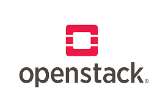
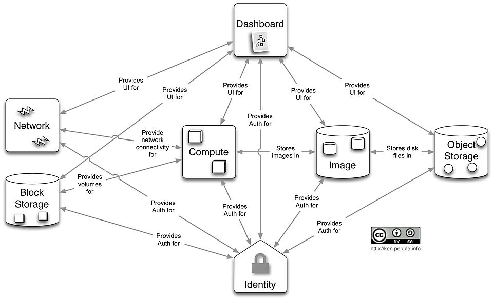

---
hide:
    - toc
---
# OpenStack: The Open-Source Cloud Platform

---

## What is OpenStack?

### What is it?
**OpenStack** is an **open-source cloud computing platform** for building and managing **private and public clouds**. It provides Infrastructure-as-a-Service (**IaaS**) by pooling compute, storage, and networking resources, all managed through a **dashboard (Horizon)** or **RESTful APIs**.

In simple terms:  
OpenStack lets organizations build their own **private cloud** — similar to AWS or Azure, but on their **own hardware** and fully customizable.

---

## Theoretical Definition
OpenStack is a **modular cloud operating system** that controls large pools of compute, storage, and networking resources in a data center, managed through a web interface, APIs, or CLI.  

It was originally created in 2010 by **Rackspace Hosting and NASA** and is now maintained by the **OpenInfra Foundation**.

---

## Why OpenStack? (Role in Private Cloud)

### Key Benefits
- **Open-source**: No vendor lock-in, fully customizable.
- **Private Cloud Enabler**: Build your own AWS/Azure-like infrastructure inside your data center.
- **Scalable**: Supports small labs to large enterprise deployments.
- **Multi-tenancy**: Securely isolates workloads for different users/teams.
- **API-driven**: Integrates with DevOps and automation tools (Terraform, Ansible, Kubernetes).

👉 OpenStack is widely used by telecom providers, governments, and enterprises that want **cloud agility while retaining control**.

---

## OpenStack Core Components

OpenStack is made of many services, each handling a specific function:

- **Nova** → Compute service (manages VMs and instances).  
- **Neutron** → Networking (virtual networks, routers, firewalls, SDN integration).  
- **Cinder** → Block Storage (persistent storage for VMs).  
- **Swift** → Object Storage (similar to Amazon S3).  
- **Glance** → Image service (stores VM images and templates).  
- **Keystone** → Identity service (authentication, authorization).  
- **Horizon** → Dashboard (web UI for managing OpenStack).  
- **Heat** → Orchestration (templates for automated cloud deployments).  
- **Ceilometer** → Telemetry (monitoring, billing, usage).  

---

## OpenStack vs Public Cloud (AWS/Azure)

| Feature           | OpenStack (Private Cloud)                      | AWS/Azure (Public Cloud)                  |
|-------------------|------------------------------------------------|-------------------------------------------|
| **Ownership**     | Organization-owned and managed                 | Provider-owned and managed                |
| **Deployment**    | Runs in local data center                      | Runs on provider’s global infrastructure  |
| **Cost Model**    | CapEx (hardware) + maintenance                 | OpEx (pay-as-you-go)                      |
| **Customization** | Fully customizable (open-source)               | Limited to provider’s services            |
| **Use Case**      | Private cloud, compliance-driven workloads     | Public-facing apps, global scale          |

👉 OpenStack is often used as the **foundation for private/hybrid clouds**, sometimes integrated with AWS, Azure, or GCP for hybrid models.

---

## Vendors & Distributions

Several companies provide commercial support and customized versions of OpenStack:

- **Red Hat OpenStack Platform (RHOSP)**  
- **Canonical’s Charmed OpenStack (Ubuntu-based)**  
- **Mirantis Cloud Platform**  
- **SUSE OpenStack Cloud**  
- **Huawei FusionSphere (OpenStack-based)**  

---

## Real-World Use Cases
- **Telecom Industry (5G Core Networks):** OpenStack powers NFV (Network Function Virtualization).  
- **Government Clouds:** Secure, private deployments for compliance.  
- **Research & Universities:** Flexible, low-cost private clouds for HPC.  
- **Enterprises:** Run private clouds for internal apps, dev/test, and regulated workloads.  

---

## Example Scenario
At **TechOps Inc.**, the IT team wants to run a **private cloud** for developers.  

- OpenStack is deployed across 5 servers.  
- Developers log in to Horizon and spin up VMs within minutes.  
- Storage is provided by **Cinder (block)** and **Swift (object)**.  
- Networking managed by **Neutron**.  
- Authentication handled by **Keystone**.  

This setup allows TechOps Inc. to provide an **AWS-like experience internally**, without depending on public cloud providers.

---

!!! tip "WOW Tip"
    OpenStack is the **second most deployed open-source project in the cloud world after Kubernetes**. 

!!! tip "Fun Fact"
    Many **public cloud providers (like OVH, Rackspace, and CityCloud)** actually run their services **on top of OpenStack**.

---

# Summary
- OpenStack is an **open-source cloud platform** for building private and hybrid clouds.  
- It provides modular services for compute, storage, networking, and management.  
- Competes with AWS/Azure by offering on-premise cloud capabilities.  
- Widely adopted in telecom, government, research, and enterprises.  

---
