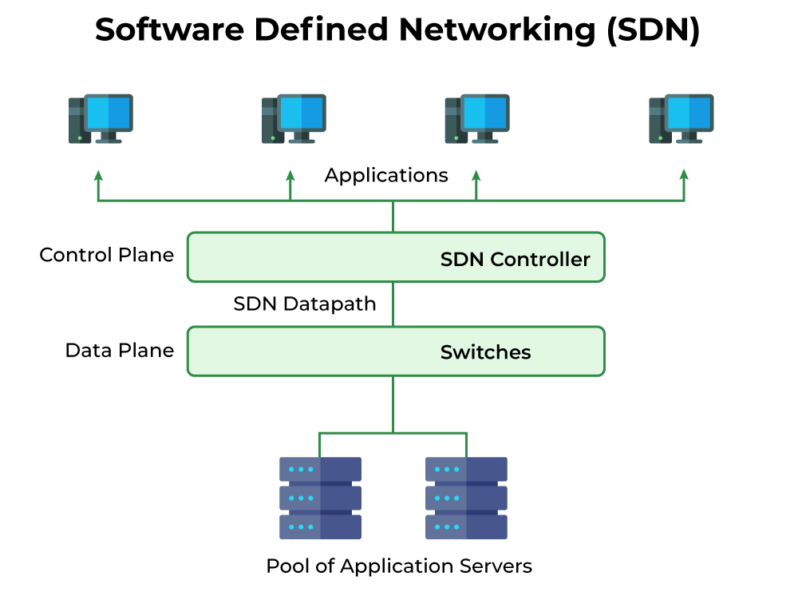

---
hide:
    - toc
---
# Software-Defined Networking (SDN)

---

## What is SDN?

### What is it?
**Software-Defined Networking (SDN)** is a modern approach to networking that separates the **control plane** (decision-making about where traffic goes) from the **data plane** (the actual movement of traffic). This allows networks to be **programmatically managed** through software rather than relying only on hardware (switches and routers).

In simple terms:  
Traditional networking = manually configuring each switch/router.  
SDN = central brain (controller) manages the whole network using software and APIs.

---

## Theoretical Definition
According to the **ONF (Open Networking Foundation)**:  
> SDN is an architectural approach that enables programmatic management, dynamic provisioning, and automation of networks by decoupling control and forwarding functions.

Key concept:  
- **Control Plane** → Centralized in SDN controller (software).  
- **Data Plane** → Distributed across physical devices (switches/routers).  
- **Northbound APIs** → Connect applications to the controller.  
- **Southbound APIs** → Connect controller to devices (e.g., OpenFlow).  

---

## SDN Architecture

### Layers:

1. **Application Layer**  
   
    - Business applications (firewall policies, load balancing, monitoring).  
    - Communicate with the controller using **northbound APIs**.  

2. **Control Layer (SDN Controller)**  
   
    - Acts as the **brain** of SDN.  
    - Examples: OpenDaylight, ONOS, Cisco APIC.  
    - Provides a global view of the network.  

3. **Infrastructure Layer (Data Plane)** 
   
    - Physical or virtual switches and routers.  
    - Forward packets based on controller instructions.  

---

## Key Benefits of SDN
- **Centralized Control**: One controller manages the whole network.  
- **Programmability**: Network behavior is defined in software.  
- **Agility**: Faster provisioning of services.  
- **Scalability**: Manage thousands of devices with ease.  
- **Cost Savings**: Uses commodity hardware, reduces vendor lock-in.  
- **Integration with Cloud**: Works seamlessly with virtualization and OpenStack/Kubernetes.  

---

## SDN vs Traditional Networking

| Feature                | Traditional Networking                          | Software-Defined Networking (SDN)            |
|-------------------------|------------------------------------------------|-----------------------------------------------|
| **Control Plane**       | Distributed across each device                 | Centralized in SDN Controller                 |
| **Data Plane**          | Same device as control plane                   | Remains in switches/routers                   |
| **Configuration**       | Manual per device (CLI)                        | Automated via APIs                            |
| **Agility**             | Slow, hardware-dependent                       | Fast, software-driven                         |
| **Visibility**          | Limited to device-level                        | Global network view from controller           |
| **Cost**                | Proprietary, expensive hardware                | Commodity hardware, open-source flexibility   |

---

## SDN Protocols
- **OpenFlow** → Most widely used, standard southbound protocol.  
- **NETCONF** → Configuration protocol for network devices.  
- **REST APIs** → Used for northbound communication with applications.  

---

## Leading SDN Vendors & Platforms
- **Cisco ACI (Application Centric Infrastructure)**  
- **VMware NSX**  
- **OpenDaylight (open source)**  
- **ONOS (Open Network Operating System)**  
- **Nutanix Flow (security-focused SDN)**  
- **Juniper Contrail**  

---

## Real-World Use Cases
1. **Data Centers** → Dynamic bandwidth allocation, tenant isolation.  
2. **Cloud Environments** → OpenStack Neutron integrates with SDN.  
3. **Telecom Providers** → 5G networks use SDN + NFV for slicing.  
4. **Campus Networks** → Simplified policy-based management.  
5. **Security** → Microsegmentation with VMware NSX.  

---

## Example Scenario

At **TechOps Inc.**, the IT team deploys an **SDN controller** to manage 50 switches across two data centers.  

- Instead of logging into each switch, they configure traffic policies in the SDN controller.  
- When a new application is deployed in OpenStack, the SDN controller automatically provisions network paths.  
- Security teams use SDN to isolate traffic between finance and HR applications (microsegmentation).  

---

!!! tip "WoW Tip"
    Google uses SDN in its global **B4 WAN (Wide Area Network)** to manage inter-data center traffic. This allows Google to dynamically allocate bandwidth for services like YouTube, Gmail, and Google Search — improving performance and reducing costs.

---

# Summary
- **SDN separates control plane from data plane**, enabling programmable, centralized network management.  
- It provides agility, scalability, and integration with cloud-native environments.  
- Core architecture: **Application Layer → Controller → Infrastructure Layer**.  
- Widely used in data centers, telecom, cloud, and enterprise networks.  

---
