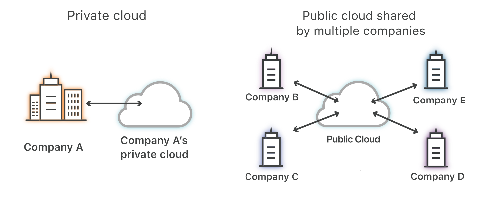

---
hide:
    - toc
---

# 📘 Introduction to Public Cloud

!!! info "Objectives"
    By the end of this chapter, you should be able to:

    - Define what **public cloud** is and how it differs from private/hybrid models.  
    - Explain the **key advantages and challenges** of public cloud.  
    - Understand **why organizations adopt public cloud** for IT infrastructure and DevOps.  
    - Identify **common use cases** (where public cloud is a good fit, and where it’s not).  

---

## 🌩️ What is Public Cloud?

A **public cloud** is a computing model where IT services (compute, storage, networking, AI, databases, etc.) are delivered over the internet by a third-party provider.  

- The infrastructure (data centers, servers, storage) is **owned and managed** by the cloud provider.  
- Customers **rent or subscribe** to resources on demand.  
- Examples: **Amazon Web Services (AWS)**, **Microsoft Azure**, **Google Cloud Platform (GCP)**, **Oracle Cloud Infrastructure (OCI)**.  

👉 Think of it like **electricity**: instead of building your own power plant (private data center), you pay only for the electricity (compute/storage) you consume.  

---

## 🏢 Public vs Private vs Hybrid Cloud

| Model            | Who owns it?                     | Where does it run? | Typical Use Case |
|------------------|----------------------------------|--------------------|------------------|
| **Public Cloud** | Third-party providers (AWS, etc.)| Shared data centers | Startups, enterprises scaling quickly |
| **Private Cloud**| Single organization              | On-premises or dedicated data center | Banks, defense, sensitive workloads |
| **Hybrid Cloud** | Mix of both                      | Combines private + public | Enterprises needing flexibility |

---

## ✅ Key Characteristics of Public Cloud
1. **On-Demand Self-Service** – Provision servers or storage instantly.  
2. **Broad Network Access** – Services accessible from anywhere via the internet.  
3. **Resource Pooling** – Multi-tenancy (resources shared across many customers).  
4. **Elasticity & Scalability** – Scale up/down automatically with demand.  
5. **Pay-as-You-Go Pricing** – No upfront capital expense.  

These characteristics align with **NIST’s definition of cloud computing**.  

---

## 💡 Why Do Organizations Use Public Cloud?

### Benefits:
- **Cost Efficiency** → No large upfront capex, pay only for usage.  
- **Speed & Agility** → Launch new applications in minutes.  
- **Global Reach** → Deploy apps close to customers in multiple regions.  
- **Innovation** → Access to advanced services (AI, ML, IoT, big data).  
- **High Availability** → Built-in redundancy across multiple zones.  

### Challenges:
- **Data Security & Compliance** → Sensitive data may need private cloud.  
- **Vendor Lock-in** → Hard to move workloads between providers.  
- **Performance Variability** → Dependent on internet and shared infra.  
- **Cost Overruns** → If not managed, pay-as-you-go can become expensive.  

---

## 🌍 Real-World Use Cases
1. **Startups** → Launch globally with zero upfront investment.  
   
    - Example: A fintech startup hosting mobile app backend on AWS Lambda + DynamoDB.
  
2. **Enterprises** → Migrate legacy workloads to reduce data center costs. 
 
    - Example: A bank using Azure for customer portals but keeping core banking on private cloud.  
  
3. **DevOps/IT Teams** → Automate CI/CD pipelines in cloud environments. 
    
    - Example: GitHub Actions deploying code to GCP Kubernetes clusters.  
  
4. **Big Data & AI** → Process petabytes of data using managed ML/AI services.  
   
    - Example: Netflix running recommendation engine on AWS.  

---

## 🧭 Key Takeaway
The **public cloud is now the default platform** for modern IT and DevOps. 

- It offers **speed, scalability, and global access**.  
- It does not eliminate **private or hybrid cloud** but often complements them.  
- As future DevOps/IT engineers, your skillset must include **understanding public cloud services and APIs**.  

---

✨ Next Chapter:  
We’ll explore **“Services Provided by Public Clouds & Comparison of Top Providers”** (AWS, Azure, GCP).  
