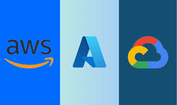

---
hide:
    - toc
---
# 📘 Services Provided by Public Clouds & Comparison of Top Public Cloud Providers

!!! info "Objectives"
    By the end of this chapter you will be able to:

    - Describe the core **service models** (IaaS, PaaS, SaaS, CaaS, FaaS) used by public cloud providers.  
    - List and explain the major **service categories** offered by clouds (compute, storage, DB, networking, security, serverless, containers, analytics, AI/ML, CDN, migration, monitoring).  
    - Compare the **leading public cloud providers** (AWS, Microsoft Azure, Google Cloud Platform) at a high level — strengths, enterprise fit, and hybrid/multicloud strategies.  
    - Know where to look (official docs) and what hands-on exercises to do next.

!!! tip "Quick context"
    Public cloud is dominated by a few large providers — often referenced as the “big three” (AWS, Microsoft Azure, Google Cloud). This dominance affects available features, global reach, pricing pressure, and partner ecosystems.

---

## Cloud service-models (short & practical definitions)

- **IaaS (Infrastructure as a Service)**  
  Low-level building blocks (VMs, block storage, virtual networks). You manage OS, runtime, apps; provider manages hypervisor, physical hosts, networks, and storage.

- **PaaS (Platform as a Service)**  
  Managed runtime/platform for apps (platform hides OS/patching). Examples: managed app-hosting, managed databases, managed integration services.

- **SaaS (Software as a Service)**  
  Fully managed applications delivered over the web (e.g., Office 365, Salesforce). No infra management.

- **CaaS (Containers as a Service)**  
  Managed container hosting/orchestration platforms (hosted Kubernetes or container services).

- **FaaS / Serverless (Function as a Service)**  
  Short-lived functions invoked by events; provider manages scaling and server management (e.g., AWS Lambda).

!!! info "Practical note" 
    Vendor APIs/CLIs/SDKs let you automate IaaS/PaaS/FaaS operations (create VM, attach storage, create bucket, or deploy function).
---

# 📘 Core Service Categories in Public Cloud

---

### Compute (Running Applications)

- **What it is**: Virtual machines, containers, or serverless functions that run your applications.  

- **Why it matters**: Every app needs compute power (CPU + memory).  

- **Examples**:  
    - AWS → EC2, Lambda  
    - Azure → Virtual Machines, Azure Functions  
    - GCP → Compute Engine, Cloud Functions  

- **Watch out for**:  
    - Choosing wrong instance size = higher costs.  
    - Data on temporary disks is lost if VM stops.  

---

### Storage (Saving Data)

- **What it is**: Services to store files, application data, or databases.  

- **Types**:  
    - **Object Storage** → for files, images, backups (S3, Blob, Cloud Storage).  
    - **Block Storage** → attached to VMs, like virtual hard drives (EBS, Managed Disks, Persistent Disk).  
    - **File Storage** → shared network drives (EFS, Azure Files, Filestore).  

- **Why it matters**: Different apps need different storage types (databases need block storage, websites need object storage).  

- **Watch out for**:  
    - Data transfer (egress) costs.  
    - Access permissions — misconfigured storage often causes data leaks.  

---

### Databases

- **What it is**: Managed relational (SQL) or non-relational (NoSQL) databases.  

- **Why it matters**: Almost all apps need structured data storage.  

- **Examples**:  
    - Relational: RDS (AWS), Azure SQL Database, Cloud SQL (GCP).  
    - NoSQL: DynamoDB, Cosmos DB, Firestore.  
    - Analytics: Redshift, Synapse, BigQuery.  

- **Watch out for**:  
    - Costs can grow quickly with scale.  
    - Replication/backup setup is critical for DR.  

---

### Networking & Content Delivery

- **What it is**: Services that connect cloud resources and deliver apps globally.  

- **Why it matters**: Without networking, your VM is isolated.  

- **Examples**:  
    - VPC (all providers) → private cloud networks.  
    - Load Balancers → distribute traffic.  
    - CDN → caches content near users (CloudFront, Azure CDN, Cloud CDN).  

- **Watch out for**:  
    - Misconfigured firewalls can expose resources publicly.  
    - Cross-region data transfer adds cost.  

---

### Identity & Security

- **What it is**: Tools to control **who can access what** in your cloud.  

- **Why it matters**: Security is the #1 risk in cloud.  

- **Examples**:  
    - IAM (AWS), Azure Active Directory, IAM (GCP).  
    - Key Management: AWS KMS, Azure Key Vault, Cloud KMS.  

- **Watch out for**:  
    - Over-permissive policies (“*” access).  
    - Misconfigured public buckets.  

---

### Serverless & Event-Driven

- **What it is**: Running code without managing servers.  

- **Why it matters**: Great for automating small tasks, cost-efficient.  

- **Examples**:  
    - AWS Lambda, Azure Functions, GCP Cloud Functions.  

- **Use case**:  
    Process image when it’s uploaded to storage.  

- **Watch out for**:  
    - Execution time limits.  
    - Cold-start latency.  

---

### Containers & Orchestration

- **What it is**: Run applications in lightweight, portable containers.  

- **Why it matters**: Industry standard for microservices.  

- **Examples**:  
    - AWS EKS, Azure AKS, Google GKE (all are managed Kubernetes).  

- **Watch out for**:  
    - Cluster cost (idle nodes still cost money).  
    - Networking/storage setup for stateful apps.  

---

### Monitoring & Logging

- **What it is**: Services to track performance, errors, and logs.  

- **Why it matters**: Without monitoring, you don’t know when systems fail.  

- **Examples**:  
    - AWS CloudWatch, Azure Monitor, Google Cloud Operations Suite.  

- **Watch out for**:  
    - High logging costs with verbose apps.  
    - Need alerts (not just dashboards).  

---

### Big Data & Machine Learning

- **What it is**: Platforms to process massive datasets and build AI models.  

- **Why it matters**: Modern apps rely on analytics & AI.  

- **Examples**:  
    - AWS SageMaker, Azure ML, Google Vertex AI.  
    - AWS EMR, Azure Synapse, Google BigQuery.  

- **Watch out for**:  
    - Data transfer costs between services.  
    - Lack of data governance.  

---

### Migration & Hybrid Tools

- **What it is**: Services to move apps/data into cloud or connect on-prem data centers.  

- **Why it matters**: Few companies start from scratch in cloud.  

- **Examples**:  
    - AWS DMS (Database Migration Service), Azure Migrate, GCP Migrate for Compute.  

- **Watch out for**:  
    - Large data transfers take time/cost.  
    - Need cutover planning to avoid downtime.  

---

### Cost Management & Marketplace

- **What it is**: Tools to control spending + app marketplace.  

- **Why it matters**: Cloud can get expensive if not managed.  

- **Examples**:  
    - Cost Explorer (AWS), Cost Management (Azure), Billing Reports (GCP).  
    - Marketplaces with pre-built apps (VM images, SaaS).  

- **Watch out for**:  
    - Hidden egress/network charges.  
    - Marketplace apps may have extra licensing costs.  

---

!!! tip "Key Takeaway"
    - All cloud providers offer these **11 categories**, even if names differ.  
    - Focus on the **concepts**, not the brand names. Once you understand categories, you can map them across AWS, Azure, and GCP.  

---

## How clouds expose functionality (APIs, CLI, SDKs)
- **RESTful APIs** + JSON payloads are the canonical programmatic interface.  
- **CLIs** (aws/az/gcloud) provide scriptable tooling for labs and automation.  
- **SDKs** (Python/Go/Java/Node) are used inside applications and CI/CD pipelines.  
- **Infrastructure-as-Code** (Terraform, CloudFormation, ARM templates) enables reproducible infra and policy-as-code.

---

## Top public cloud providers: short comparison & positioning

### Provider-at-a-glance (high-level)

| Provider | Strengths / Differentiator | Enterprise fit / Common use-cases | Hybrid / Edge offering |
|---|---|---|---|
| **AWS (Amazon Web Services)** | Largest breadth of services and global regions; mature ecosystem; many instance types and specialized hardware | Startups → enterprise, feature-rich production systems, AI/ML infrastructure, broad partner ecosystem | Outposts, Local Zones, Snow family for edge & data transfer |
| **Microsoft Azure** | Deep enterprise integration (Active Directory, Windows Server, SQL Server), strong hybrid story | Enterprises with Microsoft stack, large corp migrations, SaaS integrations | Azure Arc, Azure Stack for on-prem hybrid |
| **Google Cloud Platform (GCP)** | Data, analytics and ML-first: strong data services and scale; network performance | Data analytics platforms, ML/AI workloads, Kubernetes-native apps | Anthos for hybrid/multicloud, edge solutions |

> Note: Each provider also offers multi-region redundancy, compliance frameworks, and managed enterprise support tiers.

---

## Example provider strengths explained (practical)
- **AWS**: unmatched service variety — good when you need a very specific managed service (e.g., managed message brokers, streaming, specialized instances). AWS docs are the canonical reference for its service behaviors.
- **Azure**: excellent if your environment is Windows-heavy or you want frictionless Active Directory + identity integration and vendor support agreements. Azure’s storage (Blob) and VM offerings are comparable to others and integrate tightly with Microsoft ecosystem tools. 
- **GCP**: invests heavily in data platforms (BigQuery), low-latency networking, and Kubernetes. Its Compute and data services are optimized for analytics and large-scale data processing.

---

## How similar are services between providers?
- Functionally most categories exist across providers (compute, object storage, managed DBs, serverless, managed kubernetes, CDN) — they differ mainly in API/CLI ergonomics, SLA/pricing, extra features, and regional availability. Google provides an official service comparison/mapping which is useful to study when migrating or comparing features.

---

## Summary 
- Public clouds provide the *same core categories* (compute, storage, networking, IAM, DB, serverless, containers), but **each provider packages and names these services differently**. Understanding the category matters more than memorizing names.  
- Start practical learning with **one provider** or choose provider based on your institution's priorities; then learn how to translate concepts across vendors.  
- Next chapter will give a **service-name mapping table** (AWS / Azure / GCP) and deeper explanations of common services so students can map terms across providers.

---