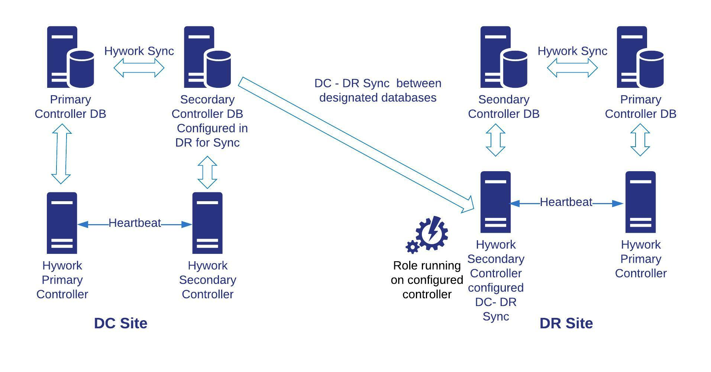

---
hide:
    - toc
---

# Data Center and Disaster Recovery (DC/DR) Management

## DC/DR Migration

**Definition**

- **DC/DR Migration** refers to the process of moving data, applications, or infrastructure from one data center (DC) to another or to a disaster recovery (DR) site to ensure business continuity, enhance performance, or meet compliance requirements.
- It involves transferring workloads, configurations, and data while minimizing downtime and ensuring data integrity.

---

**Why DC/DR Migrations Are Done**

- **Business Continuity**: Ensures applications and data remain available during disasters (e.g., natural calamities, power outages).
- **Cost Optimization**: Relocates to a more cost-effective data center or cloud provider to reduce operational expenses.
- **Performance Improvement**: Moves to a geographically closer data center to reduce latency for end-users.
- **Compliance**: Meets regulatory requirements by hosting data in specific regions or secure facilities.
- **Modernization**: Upgrades to newer infrastructure or cloud-based environments for better scalability and efficiency.

---

**How DC/DR Migrations Are Done**

**Planning**:

  - Assess current infrastructure, applications, and dependencies.
  - Define migration goals (e.g., zero downtime, minimal data loss).
  - Choose the target environment (e.g., another data center, cloud provider like AWS or Azure).
  
**Data Replication**:

  - Replicate data to the target site using tools like rsync, AWS DataSync, or Azure Site Recovery.
  - Ensure data consistency between source and target.

**Application Migration**:

  - Use lift-and-shift (moving as-is), re-platforming (minor adjustments), or refactoring (rewriting for new environment).
  - Test applications in the target environment before full migration.
  
**Testing and Validation**:

  - Conduct dry runs to validate configurations and performance.
  - Verify network connectivity, security settings, and application functionality.
  
**Cutover**

  - Switch operations to the new site with minimal disruption.
  - Use DNS updates or load balancers to redirect traffic.

**Post-Migration**:

  - Monitor performance and resolve issues.
  - Decommission old infrastructure if no longer needed.

---

**Planning DR Drills**

**Purpose**: Simulate disaster scenarios to test the effectiveness of the DR plan.

**Steps**:

  - Schedule drills during low-impact periods.
  - Define failure scenarios (e.g., server failure, network outage).
  - Execute failover to the DR site and measure recovery time.
  - Document results and update the DR plan based on findings.

**Frequency**: Conduct drills quarterly or biannually to ensure preparedness.

---

**Real-World Examples**

- A financial institution migrates its data center to AWS to comply with regional data residency laws, using AWS Database Migration Service for seamless data transfer.
- A retail company conducts a DR drill by simulating a power outage, failing over to a secondary data center using VMware Site Recovery Manager to ensure zero downtime for its e-commerce platform.

---

## DC/DR Storage Synchronization

**Definition**

**DC/DR Storage Synchronization** is the process of continuously replicating and synchronizing data between a primary data center and a disaster recovery site to ensure data availability and consistency during failover.

- It ensures that the DR site has an up-to-date copy of critical data to support recovery operations.

---

**Why DC/DR Storage Synchronization Is Done**

- **Data Availability**: Ensures data is accessible at the DR site during a disaster.
- **Minimized Data Loss**: Reduces the risk of data loss by keeping primary and DR sites in sync.
- **Faster Recovery**: Enables quick failover to the DR site with minimal downtime.
- **Compliance**: Meets regulatory requirements for data redundancy and backup.

---

**How DC/DR Storage Synchronization Is Done**

**Replication Methods**:
  
  - **Synchronous Replication**: Data is written to both primary and DR sites simultaneously, ensuring zero data loss but requiring high-bandwidth, low-latency connections.
  - **Asynchronous Replication**: Data is written to the primary site first and then replicated to the DR site with a slight delay, suitable for geographically distant sites.
  
**Tools and Technologies**:

  - Use storage solutions like ZFS, NetApp SnapMirror, or AWS S3 Cross-Region Replication for data synchronization.
  - Implement block-level replication for databases or file-level replication for shared storage.

**Monitoring and Validation**:

  - Monitor replication status using tools like Nagios or AWS CloudWatch.
  - Validate data integrity with checksums or hash comparisons.
  
**Failover and Failback**:

  - During a disaster, switch to the DR site using synchronized data.
  - After recovery, synchronize changes back to the primary site (failback).

---

**Planning DR Drills for Storage Synchronization**

- Test synchronization by simulating data corruption or site failure.
- Verify that the DR site can serve synchronized data without errors.
- Measure Recovery Point Objective (RPO) and Recovery Time Objective (RTO) to ensure they meet business requirements.

---

**Real-World Examples**

- A healthcare provider uses Azure Blob Storage with Geo-Redundant Storage (GRS) to synchronously replicate patient records across regions, ensuring compliance with HIPAA regulations.
- An e-commerce company uses ZFS snapshots and replication to synchronize product inventory data between its primary data center and a DR site, enabling quick recovery during server failures.

  
