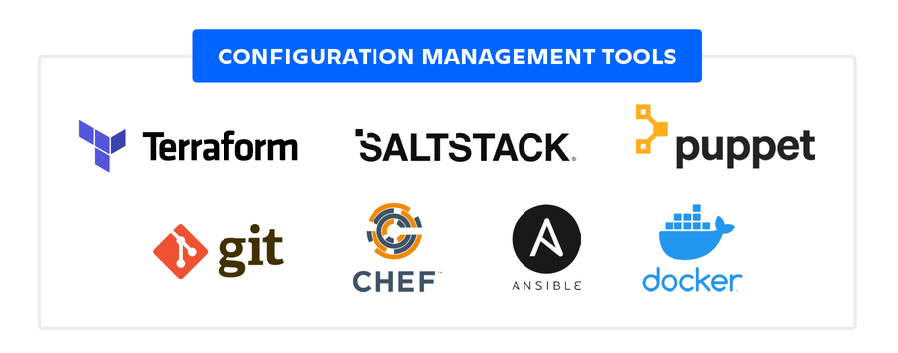

---
hide:
    - toc
---
# Configuration Management

!!! info "Objectives"

    - Understand what configuration management (CM) is and why it matters.  
    - Distinguish CM from simple deployment scripts.  
    - Learn the common CM tools (Chef, Puppet, Ansible, Salt) and how they differ.  
    - See concrete examples (playbook/manifest/recipe) and real-world use cases.  
    - Know core CM concepts: desired state, idempotence, convergence, agent vs agentless, inventories, modules/cookbooks/manifests, and testing.

---

## What is Configuration Management?
- **Definition:** Configuration Management is the practice and tooling that ensures systems (servers, network devices, containers) are configured to a defined “desired state” and remain in that state over time.  
- **Core idea:** Declare *what* the system should look like (packages installed, services running, files present, users created) and have software enforce that state automatically and repeatedly.  
- **Key properties:** declarative (describe end-state), idempotent (apply repeatedly without side-effects), automated (applied by tooling), and auditable (reporting and drift detection).

---

## Why Configuration Management is Needed
- **Scale and consistency:** Manual configuration doesn’t scale; CM ensures hundreds or thousands of nodes get consistent configuration.  
- **Drift prevention:** CM continuously or periodically enforces the desired state, preventing configuration drift.  
- **Repeatable environments:** Recreate staging, test, and production environments reliably.  
- **Compliance & security:** Enforce security baselines (patch levels, firewall rules, user accounts) and produce audit logs.  
- **Faster recovery & onboarding:** New nodes can be brought to production state automatically; recovery and scaling are faster.  
- **Separation of concerns:** Operators and developers can express infrastructure and configuration as code.

---

## Configuration Management vs Deploy Scripts
- **Deploy scripts (procedural):**
    - Typically a sequence of commands: `apt-get install X`, `edit file`, `systemctl restart`.
    - Focus on *how* to perform steps (imperative).
    - Often not idempotent; re-running the script can create duplicates or errors.
    - Useful for one-off tasks or ad-hoc automation.

- **Configuration Management (declarative / idempotent):**
    - Expresses *what* the final state should be (package X must be present, service Y must be running).
    - Applying the same definition repeatedly yields the same result (idempotence).
    - Provides abstractions (roles, modules, resources), reporting, and testing frameworks.
    - Supports orchestration and drift correction.

---

## Core Concepts & Components
- **Desired state:** The specification of how a node should be configured (packages, files, services, users, permissions).  
- **Resources:** Smallest unit of change (e.g., package resource, file resource, service resource).  
- **Runbook / Manifest / Playbook / Cookbook:** The file(s) that describe desired state (terminology varies by tool).  
- **Idempotence:** Re-applying the same policy results in no change if the system already matches the desired state.  
- **Convergence:** Process by which nodes reach the desired state after applying CM instructions.  
- **Inventory / Nodes list:** The set of systems targeted by runs (e.g., Ansible inventory, Puppet nodes).  
- **Agent vs Agentless:**
    - **Agent-based:** An agent (daemon) runs on each node and polls or accepts connections from a central server (Chef, Puppet).  
    - **Agentless (push-based):** A controller connects over SSH (or WinRM) to nodes and applies changes (Ansible).  
- **Master/Server vs Masterless:** Central server manages configs and stores metadata (Chef/Puppet) vs masterless modes where nodes pull or apply local configs.  
- **Modules / Cookbooks / Roles / Classes:** Reusable collections of configuration (packaging policies, templates, tasks).

---

## Popular Tools — Overview & Differences

| Tool     | Model              | Language / Format      | Agent | Strengths | Typical use-cases |
|----------|--------------------|------------------------|-------|----------|-------------------|
| **Ansible** | Push-based, controller-driven | YAML playbooks (simple) | Agentless (SSH/WinRM) | Simple, fast to start, human-readable | Bootstrapping, ad-hoc tasks, deployments, small-to-medium fleets |
| **Chef**   | Client-server (also solo)   | Ruby DSL (recipes/cookbooks) | Agent (chef-client) | Very flexible DSL, strong ecosystem, good for complex workflows | Large-scale configuration requiring complex logic and test tooling |
| **Puppet** | Master-agent (also apply)  | Puppet DSL (manifests) | Agent (puppet-agent) | Mature reporting, model-driven config, robust for enterprise | Policy/compliance at scale, detailed reporting |
| **Salt**   | Master-minion (real-time)  | YAML / Python states    | Agent (salt-minion) | Fast remote execution, event-driven, scalable | Real-time orchestration, event-driven workflows |



### Key differences explained
- **Agent vs agentless:** Agent-based solutions allow node-initiated pulls and centralized reporting; agentless solutions (Ansible) require no pre-installed agent and work over SSH, simplifying initial setup.  
- **Language and complexity:** Chef and Puppet use more expressive DSLs (Ruby-like or domain-specific), allowing complex logic but with steeper learning curves; Ansible uses YAML that is easier for beginners.  
- **Ecosystem & modules:** All tools provide large module repositories (Ansible Galaxy, Chef Supermarket, Puppet Forge) with reusable roles/cookbooks/manifests.  
- **Reporting & compliance:** Puppet/Chef often provide richer state reporting, node classification, and enterprise features (Puppet Enterprise, Chef Automate).  
- **Use pattern:** Ansible is frequently used for orchestration and ad-hoc tasks; Chef/Puppet for long-term node enforcement at scale.

---

## Architecture Patterns
- **Centralized server (Master) + Agents:** Master stores configurations, agents pull catalogs and report back. Good for large fleets and fine-grained reporting (Puppet, Chef).  
- **Controller (push) model:** Controller pushes changes over SSH to nodes (Ansible). Simpler to set up; ideal for heterogeneous environments and episodic runs.  
- **Hybrid / Masterless:** Tools can be used in masterless modes (e.g., chef-solo, puppet apply) for ephemeral or cloud-native nodes.  
- **Immutable infrastructure workflow:** Build golden images (AMIs/container images) via CI using CM during image bake, then deploy immutable images rather than mutating running servers. CM still used during image build or for bootstrapping.

---

## Typical CM Workflows
- **Bootstrapping (first-boot):** Use CM to install runtime, app dependencies, create users, register with monitoring.  
- **Configuration enforcement (continuous):** Agents periodically re-apply manifests/playbooks to maintain state.  
- **Orchestration:** Execute ordered tasks across multiple nodes (e.g., database schema changes, rolling restarts).  
- **Policy-as-code & compliance:** Express security and compliance rules as code and audit node compliance.

---

## Idempotence — What it is & why it matters
- **Explanation:** A change is idempotent if applying it many times produces the same outcome as applying it once.  
- **Example:** Resource `package: httpd` — if the package is already installed, the CM tool does nothing (no error).  
- **Why important:** Enables safe repeated runs (daily enforcement, automated remediation) without causing side effects or duplicate operations.

---

## Examples (practical snippets)

=== "Ansible playbook"
    ```yaml
    ---
    - name: Install and configure Apache
    hosts: webservers
    become: yes

    tasks:
        - name: Ensure httpd is installed
        package:
            name: httpd
            state: present

        - name: Ensure httpd service is running and enabled
        service:
            name: httpd
            state: started
            enabled: true

        - name: Deploy index page
        copy:
            dest: /var/www/html/index.html
            content: "<html><body><h1>Hello from Ansible</h1></body></html>"
            owner: root
            group: root
            mode: '0644'
    ```

    * **Run command:** `ansible-playbook -i inventory.ini site.yml`


=== "Puppet manifest"

    ```puppet
    class webserver {
    package { 'httpd':
        ensure => present,
    }

    service { 'httpd':
        ensure => running,
        enable => true,
        require => Package['httpd'],
    }

    file { '/var/www/html/index.html':
        ensure  => file,
        content => "<html><body><h1>Hello from Puppet</h1></body></html>",
        owner   => 'root',
        group   => 'root',
        mode    => '0644',
        require => Service['httpd'],
    }
    }

    include webserver
    ```

    * **Apply on node:** `puppet apply site.pp`


=== "Chef recipe"

    ```ruby
    package 'httpd' do
    action :install
    end

    service 'httpd' do
    action [:enable, :start]
    end

    file '/var/www/html/index.html' do
    content '<html><body><h1>Hello from Chef</h1></body></html>'
    owner 'root'
    group 'root'
    mode '0644'
    action :create
    end
    ```

    * **Run with chef-client** after uploading cookbook to Chef Server or run chef-solo for local testing.

---

## Real-world Examples & Use Cases

* **Web application fleet:** Use CM to ensure all web nodes have the same app dependencies, configuration files, and monitoring agents. During deploy, orchestrate rolling restarts so service stays online.
* **Security baseline enforcement:** Ensure SSH configuration, firewall rules, user accounts, and audit settings comply with policy. CM provides drift detection and remediation.
* **Patch management:** Schedule CM-run playbooks/manifests to apply security patches and reboot nodes in controlled waves.
* **Immutable image builds:** Use CM tools to bake AMIs/VM images via CI pipelines (TestKitchen / Packer) so runtime nodes are identical.
* **Hybrid environments:** Use agentless Ansible to manage a mix of cloud VMs, on-prem servers, and network devices; use agents for high-scale servers for better reporting.

---

## Secrets & Sensitive Data Handling

* **Never store secrets in plain text within manifests/playbooks.**
* Integrate CM with secret stores:

  * HashiCorp Vault, AWS Secrets Manager, Azure Key Vault.
* Use lookup plugins (Ansible Vault) or templating that fetches secrets at run time with proper IAM policies.

---

## Testing and Validation

* **Unit/Integration testing:** Test recipes/playbooks locally: TestKitchen (Chef), Molecule (Ansible) to verify idempotence and behavior.
* **Linting & static checks:** Use linters and style checks (rubocop for Chef, puppet-lint, ansible-lint).
* **Staging & canary:** Apply changes to staging or a small canary group before full rollout.
* **Reporting:** Collect run results and drift reports (PuppetDB, Chef Automate, Ansible Tower/AWX).

---

## CM & CI/CD Integration

* CM plays multiple roles in pipelines:

  * **Image bake stage:** Run CM in image-build to produce golden images.
  * **Deployment stage:** Trigger playbook/manifest runs as part of deploy pipelines.
  * **Rollback:** Use CM to revert configuration or deploy a previous image.
* Tools commonly integrated: Jenkins/GitHub Actions/GitLab CI triggering Ansible, Chef, or Puppet runs; storing CM code in Git for versioning and review.

---

## Best Practices (concise)

* Express configuration as **declarative, idempotent resources**.
* Keep configurations **modular** and **reusable** (roles, modules, cookbooks).
* Store CM code in **version control** and use PR-based reviews.
* Use **least-privilege** for agent/controller credentials and integrate with secret managers.
* Test changes via **automated test suites** and use staging/canaries before global rollout.
* Prefer **immutable images** for production workloads where possible; use CM for image build and minor runtime fixes only.

---

## When to use which tool (short guidance)

* **Ansible:** choose when you want quick start, agentless management, ad-hoc orchestration, and simple YAML-based playbooks. Good for bootstrapping and cross-platform tasks.
* **Chef / Puppet:** choose when you need a robust, enterprise-class CM with reporting, scaling, and complex configuration logic. Better when constant enforcement and detailed compliance reporting are required.
* **Salt:** choose when you need real-time job execution and event-driven automation at scale.

---

## Limitations & Challenges

* **Complexity at scale:** large deployments require good modular design and governance.
* **Stateful changes & ordering:** certain changes require careful orchestration (database schema updates).
* **Secrets & credential sprawl:** careful handling and auditing of credentials are required.
* **Drift outside CM:** manual changes bypassing CM cause drift; strict processes & monitoring are needed.

---

## Summary

Configuration Management is foundational for reliable, repeatable, and auditable infrastructure operations. It moves organizations from fragile, manual procedures to code-driven, testable, and enforceable infrastructure. Understanding the architecture (agent vs agentless), the core concepts (desired state, idempotence), and the practical differences between tools (Ansible, Chef, Puppet, Salt) allows engineers to pick the right tool and design effective, maintainable automation for their environment.