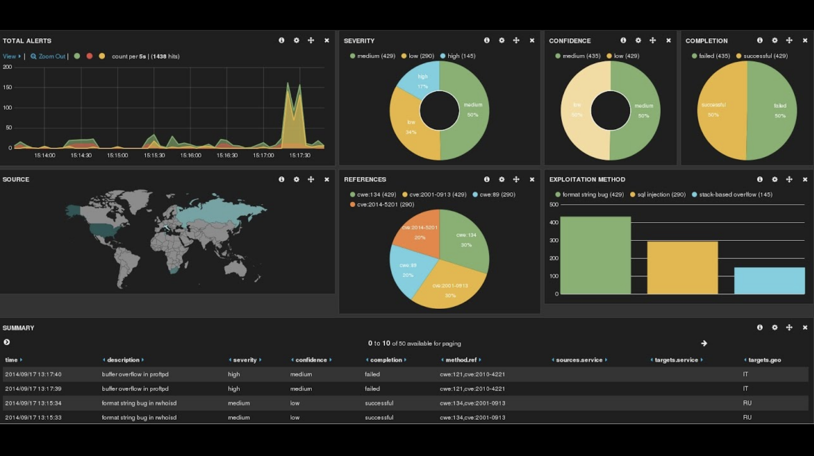
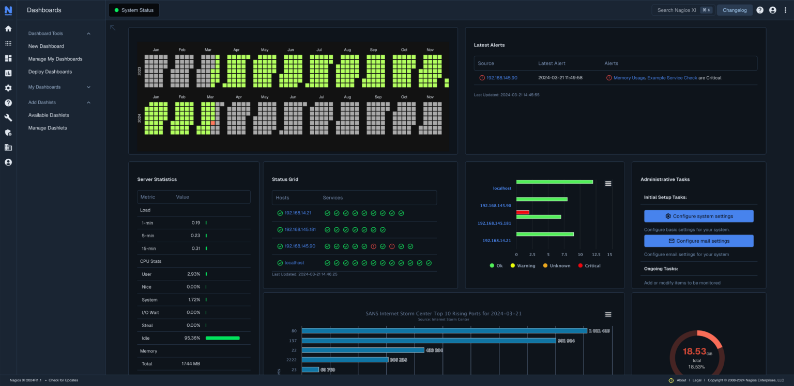

---
hide:
    - toc
---
# Monitoring, Logging & Cloud Resilience


!!! info "Learning Objectives"

    * Explain the role of centralized logging in IT infrastructure.
    * Compare monitoring solutions: Nagios vs. Prometheus.
    * Identify performance bottlenecks in data centers.
    * Understand cloud-native resilience: auto-scaling, self-healing, and zero-downtime updates.
    * Analyze a real-world cloud-enabled data center case study.

---

## Centralized Logging

* **Definition**: Collecting logs from multiple servers, applications, and devices into a single platform.
* **Why it matters**:

    * Faster troubleshooting.
    * Security auditing & compliance (PCI-DSS, HIPAA).
    * Capacity planning & trend analysis.
  
* **Tools**:

    * **ELK Stack** (Elasticsearch, Logstash, Kibana).
    * **Fluentd/Fluent Bit** for lightweight log forwarding.
    * **Cloud-native**: AWS CloudWatch Logs, Azure Monitor.



---

Got it — I’ll expand your **“Monitoring with Nagios”** section into a more complete, syllabus-aligned theory note. Here’s the enriched version in Markdown:

---

## Monitoring with Nagios

### **Nagios Overview**

Nagios is one of the most widely adopted open-source IT infrastructure monitoring tools. It provides proactive monitoring of systems, applications, services, and business processes. Administrators use Nagios to detect and resolve IT infrastructure problems before they affect critical business processes.

**Architecture**:

  * **Nagios Core**: The main monitoring engine, responsible for scheduling checks, executing plugins, and handling alerts.
  * **Plugins**: Small executables or scripts that perform actual monitoring tasks (e.g., check CPU load, memory usage, disk space, service uptime).
  * **Add-ons**: Extensions such as **Nagios XI** (commercial GUI and enterprise features) and visualization plugins.
  * **Agent-based Monitoring**: Using agents like **NRPE (Nagios Remote Plugin Executor)** for Linux/Unix or **NSClient++** for Windows to run checks locally.
  * **Agentless Monitoring**: Uses standard protocols like **SNMP, SSH, or WMI** to monitor without installing agents.

**Key Capabilities**:

  * Monitors host availability (up/down), services, network devices, and applications.
  * Supports notification via email, SMS, Slack, or ticketing system integration.
  * Enables escalation policies to ensure critical issues are addressed quickly.

---

### **Strengths of Nagios**

* **Mature Ecosystem**: With over 20 years in production use, Nagios has a proven track record in enterprise IT.
* **Extensible via Plugins**: Thousands of community and official plugins exist for virtually every system, database, and application.
* **Threshold-Based Alerts**: Simple yet powerful — define critical and warning levels for metrics (e.g., CPU > 90%).
* **Integration-Friendly**: Works with tools like Grafana, Prometheus exporters, and DevOps pipelines for hybrid monitoring.
* **Lightweight & Efficient**: Minimal resource footprint on monitoring nodes.

---

### **Limitations of Nagios**

* **Complex Configuration**: Initial setup requires editing multiple config files (hosts, services, commands). YAML/JSON-based modern tools are easier.
* **Limited Visualization**: Core Nagios provides basic web UI; modern dashboards require add-ons like Nagios XI or Grafana.
* **Scaling Challenges**: Performance bottlenecks when monitoring thousands of hosts without careful tuning.
* **Static Configs**: Dynamic cloud-native environments (Kubernetes, auto-scaling clusters) need additional integrations to work smoothly.
* **Maintenance Effort**: Manual updates to configs and plugins can become tedious in large enterprises.

---

!!! tip "**Exam/Interview Tip**"

    Expect questions like *“How does Nagios differ from Prometheus?”* (Answer: Nagios is **check-based and threshold-driven**, while Prometheus is **time-series & pull-based**, better suited for cloud-native metrics).

**Nagios Dashboard**




---


## Prometheus – Next Generation NMS

### **Key Concepts**

Prometheus is an **open-source monitoring and alerting toolkit** designed for modern, dynamic, cloud-native environments. Unlike traditional monitoring tools, Prometheus focuses on **metrics** rather than logs or events, and stores them as **time-series data**.

**Time-Series Metrics Collection**:

  * Each metric is stored with a **timestamp** and optional **labels** (key-value pairs) for context (e.g., `http_requests_total{method="GET",status="200"}`).
  * Enables detailed filtering, aggregation, and slicing of data.

**Pull-Based Model**:

  * Prometheus **scrapes** metrics from targets at regular intervals.
  * Targets expose an HTTP endpoint (usually `/metrics`) via **exporters** (e.g., Node Exporter for Linux, cAdvisor for containers, Blackbox Exporter for endpoints).
  * This model simplifies security and scaling compared to push-based monitoring.

**PromQL (Prometheus Query Language)**:

  * A powerful query language for extracting and manipulating time-series data.
  * Examples:

    ```promql
    # CPU usage above 80% in last 5 minutes
    avg(rate(node_cpu_seconds_total{mode="user"}[5m])) > 0.8
    ```
  * Enables dashboards, alerts, and ad-hoc troubleshooting.

---

### **Ecosystem**

Prometheus is rarely used alone; it integrates with a rich ecosystem of tools:

**Alertmanager**: Handles alerts generated by Prometheus rules.

  * Features: deduplication, grouping, silencing, routing to email, PagerDuty, Slack, etc.
  
**Grafana**: Visualization platform often paired with Prometheus.

  * Provides rich dashboards for real-time monitoring.
  
**Exporters**: Components that expose metrics in Prometheus format (over 500 exist).

  * Examples: MySQL exporter, JMX exporter (Java apps), SNMP exporter.
  
**Remote Storage**: Prometheus itself stores data locally (short-term). For long-term retention, integrates with Thanos, Cortex, or VictoriaMetrics.

---

### **Why “Next Gen”?**

Prometheus is considered a **next-generation network and systems monitoring (NMS)** solution because it overcomes the static, threshold-based approach of legacy tools like Nagios:

**Cloud-Native & Container-Friendly**:

  * Deep integration with **Kubernetes** (auto-discovers services, pods, and nodes).
  * Supports microservices environments where IPs and services change frequently.

**Dynamic Environments**:

  * Works seamlessly with auto-scaling, ephemeral workloads, and serverless environments.
  * Eliminates manual configuration of hosts/services.

**Scalability**:

  * Can handle millions of metrics per second when used with horizontal scaling solutions (e.g., Thanos).

**Observability Focused**:

  * Prometheus aligns with modern **observability practices** (metrics, logs, traces), not just monitoring.
  * PromQL enables real-time troubleshooting beyond static alerts.

---

!!! tip "Exam Tips"

    Be ready to contrast Prometheus with Nagios:

    * **Nagios** = event/threshold-based checks, static configs, limited cloud integration.
    * **Prometheus** = time-series metrics, dynamic discovery, Kubernetes-native, powerful queries.


---

## Identifying Bottlenecks

**Types**:

  * **CPU**: High utilization, poor thread management.
  * **Memory**: Leaks, insufficient RAM.
  * **Disk/Storage**: IOPS saturation, slow reads/writes.
  * **Network**: Latency, packet loss, bandwidth limits.
  * **Application-level**: Inefficient code, poor DB queries.

**Approach**:

  * Monitor KPIs (CPU %, latency, throughput).
  * Use APM (Application Performance Monitoring) tools.

---

## Auto-Scaling & Auto-Rebuilding

**Auto-Scaling**:

  * **Horizontal scaling**: Add/remove instances (e.g., AWS Auto Scaling Groups).
  * **Vertical scaling**: Increase resources of existing server.
  
**Auto-Rebuilding**:

  * Replace failed nodes automatically.
  * Examples: AWS ASG + health checks, Kubernetes ReplicaSets.

---

## Updating Servers Without Downtime

**Traditional problem**: Updating services means restarts → downtime.

**Modern strategies**:

  * **Blue-Green Deployment**: Maintain two environments; switch traffic.
  * **Rolling Updates**: Update nodes one at a time.
  * **Canary Releases**: Test update on a small subset of users.

---

## Auto-Healing

**Definition**: Automatic detection and recovery of unhealthy resources.

**Examples**:

  * AWS ELB terminates and replaces failed EC2 instances.
  * Kubernetes reschedules failed pods.

**Benefits**:

  * Improves resilience.
  * Reduces manual intervention.

---

## Cloud-Enabled Data Center Case Study

**Scenario – TechOps Inc.**

* Migrated from legacy monitoring (Nagios only) → Hybrid approach (Prometheus + Cloud-native tools).
* Outcomes:

    * Reduced downtime from 4 hrs/month → <30 mins/month.
    * Auto-scaling allowed handling traffic spikes (50% savings in infra cost).
    * Centralized logging improved incident response time by 40%.

---
