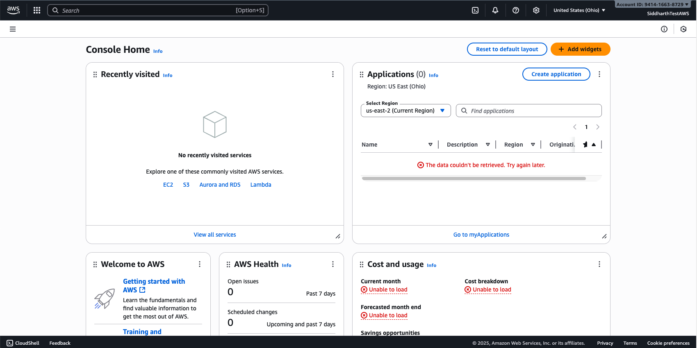

# 🧪 Lab 11: AWS Hands-On Lab

## 🎯 Objectives
In this lab you will:
- Create a **free AWS account**.  
- Launch your first **EC2 instance**.  
- Create a **Lambda function**.  
- Set up an **S3 bucket** for storage.  
- Design a **VPC with public and private subnets**.  
- Deploy instances in both subnets and enable communication.  

---

## 🔑 Prerequisites
- Laptop with internet access.  
- AWS Free Tier account (credit/debit card required for signup).  
- Basic Linux commands knowledge (`yum`, `apt`, `curl`).  

---

## 1. Create Free AWS Account
1. Go to [https://aws.amazon.com/free](https://aws.amazon.com/free).  
2. Click **Create an AWS Account**.  
3. Enter email, password, and choose an account name.  
4. Add contact details and payment method (international debit/credit card works).  
5. Verify phone number using OTP.  
6. Select **Free Tier** plan.  
7. Log in to **AWS Management Console**.  

✅ **Checkpoint**: You should see the AWS console dashboard as below.



---

## 2. Launch an EC2 Instance
1. From the AWS console, search for **EC2**.  
2. Click **Launch Instance** → give it a name (e.g., `ditiss-ec2-test`).  
3. Choose **Amazon Linux 2 AMI (Free Tier eligible)**.  
4. Select **t2.micro** (Free Tier).  
5. Create a new key pair → download `.pem` file.  
6. Network settings: allow **SSH (22)** and **HTTP (80)** from *My IP*.  
7. Launch instance.  
8. Convert you `pem` file to ppk to access from Windows Putty
   
    - Download PuTTY & PuTTYgen from [https://www.putty.org/](https://www.putty.org/)
    - Open PuTTYgen by searching **"PuTTYgen"** in you search bar
    - Click on `Load` button
    - Select your downloaded `pem` file from step 5 above
    - Click on `Save Private key` button (If prompted to save without paraphase, click Yes/Okay)
    - Give it a name which is easy to remember and save it to a known location
    - This will output a `.ppk` file which we will use next.
   
9.  Connect via Putty:
    - Open PuTTY by searching **"PuTTY"** in you search bar
    - On the left side in "Category" list, under **Connection**, expand the `SSH` option by clicking `+` sign
    - Then expand the `Auth` section by clicking `+` sign
    - Click on `Credentials`
    - Click on `Browse` on the **Private key file for authentication:** field (*The first one from the top*)
    - Browse the `.ppk` file you exported in Step 8 above and click `Open`
    - Then again on the left side list (Category) scroll to the top and click on `Session`
    - In the `Host Name (or IP Address)` enter the name or Public IP of your EC2 instance
        - To get the name of your EC2 instance, click on EC2 instance ID, then copy the **Public DNS**
        - To get the IP of your EC2 instance, click on EC2 instance ID, then copy the **Public IPv4 address**
    - Click on `Open`
    - Accept the certificate
    - Once the terminal opens up, enter user name as **ec2-user**
    - You will be logged in to your newly deployed virtual machine in AWS public cloud

✅ **Checkpoint**: You can log in to your EC2 instance.  

**Video Guide**
<iframe width="560" height="315" src="https://www.youtube.com/embed/yaqjzDkNyJQ?si=kBAFr4-ImYemzhlq" title="YouTube video player" frameborder="0" allow="accelerometer; autoplay; clipboard-write; encrypted-media; gyroscope; picture-in-picture; web-share" referrerpolicy="strict-origin-when-cross-origin" allowfullscreen></iframe>
---

## 3. Create an S3 Bucket
1. Search for **S3** in console.  
2. Click **Create Bucket** → name: `ditiss-lab-bucket-<yourname>`.  
3. Choose region (same as EC2).  
4. Block all public access (recommended).  
5. Upload a sample file (text/image).  
6. Download file back from console to confirm.  

✅ **Checkpoint**: File successfully uploaded and downloaded.  

**Video Guide**
<iframe width="560" height="315" src="https://www.youtube.com/embed/tc-uMwGt72E?si=0gfYkXR7uwIMVR0D" title="YouTube video player" frameborder="0" allow="accelerometer; autoplay; clipboard-write; encrypted-media; gyroscope; picture-in-picture; web-share" referrerpolicy="strict-origin-when-cross-origin" allowfullscreen></iframe>
---


## 4. Create a Lambda Function
1. In the console, search for **Lambda**.  
2. Click **Create Function** → Author from scratch.  
3. Function name: `ditiss-lambda-hello`.  
4. Runtime: **Python 3.x**.  
5. Use default execution role.  
6. Paste this code:

    ```python
    def lambda_handler(event, context):
        return {
            'statusCode': 200,
            'body': 'Hello from DITISS Lambda!'
        }
    ```

7. Deploy and test with a sample event.  

✅ **Checkpoint**: Output should return `"Hello from DITISS Lambda!"`.  

**Video Guide**
<iframe width="560" height="315" src="https://www.youtube.com/embed/Lu0nkVNSrHc?si=64vXqjCjkAnzSY-W" title="YouTube video player" frameborder="0" allow="accelerometer; autoplay; clipboard-write; encrypted-media; gyroscope; picture-in-picture; web-share" referrerpolicy="strict-origin-when-cross-origin" allowfullscreen></iframe>

---

## 5. Create a New VPC with Public & Private Subnets
We’ll design a custom VPC called `ditiss-lab`.  

### Step 1: Create VPC
1. Go to **VPC** in console → Create VPC.  
2. Resources to create: `VPC Only`
3. Name: `ditiss-lab`.
4. IPv4 CIDR block: `IPv4 CIDR manual input`
5. IPv4: `172.20.0.0/16`.  
6. Leave all other settings as defaul
7. Click on `Create VPC` button.  

### Step 2: Create Subnets

1.  On the VPC Dashboard page, on the right side under `Virtual Private Cloud`, click on `Subnets`
2.  Click on `Create Subnet`
3.  VPC ID: Select the subnet which has `ditiss-lab` as suffix
4.  **Public Subnet**: 
    - Subnet Name: `public-subnet`.
    - Availability Zone: `No Preference`
    - IPv4 VPC CIDR block: Selected by default `172.20.0.0/16`
    - IPv4 subnet CIDR block: `172.20.5.0/24`.
5.  **Private Subnet**:  
    - Click on `Add new subnet` button
    - Subnet Name: `private-subnet`.
    - IPv4 VPC CIDR block: Selected by default `172.20.0.0/16`
    - IPv4 subnet CIDR block: `172.20.10.0/24`.
6. Click on `Create Subnet` button

### Step 3: Internet Gateway (IGW)
1. On the VPC Dashboard page, on the right side under `Virtual Private Cloud`, click on `Internet Gateways`
2. Click on `Creat Internet gateway`
3. Name Tag: `igw-dittis-lab` 
4. Click on `Create Internet Gateway`
5. One the homepage of `Internet gateways`, select your newly created **igw-dittis-lab**
6. Click on `Action` button on the top right side
7. Select `Attach to VPC`
8. Select `ditiss-lab`
9. Click on `Attach internet gateway`

### Step 4: Create Route Tables
1. On the VPC Dashboard page, on the right side under `Virtual Private Cloud`, click on `Route Tables`
2. Click on `Create Route Tables`
3. Name: `rtb-dittis-lab`
4. VPC: `ditiss-lab`
5. Click on `Create route table`
6. On the Route tables Dashboard, select the newly created route table `rtb-dittis-lab` and click on `Action` button on top right side.
7. Click on `Edit Routes`
8. Click on `Add Route`
    - Destination: `0.0.0.0/0`
    - Target: `Internet Gateway`
        - Select `igw-dittis-lab`
    - Click on Save Changes

### Step 5: Change settings of **public-subnet**
1. On the VPC Dashboard page, on the right side under `Virtual Private Cloud`, click on `Subnets`
2. Select `public-subnet`
3. Click on `Actions` button on top right side
4. Click on `Edit subnet settings`
5. Select/Check the `Enable auto-assign public IPv4 address` in **Auto-assign IP settings** window
6. Click on `Save`
7. Again, on **Subnets** dashboard, select `public-subnet` and click on `Actions` button on top right side
8. The select `Edit route table association`
9. Route Table ID: Select `rtb-ditiss-lab`
10. Click on `Save`


### Step 6: Change settings of **private-subnet**

!!! warning "Alert"
    This setting is only for demo purposes, in real world, a private subnet should never have a public IP assigned. Instead we use a Jump/Bastion Host which acts as a jump betwen internet and private subnets.

1. On the VPC Dashboard page, on the right side under `Virtual Private Cloud`, click on `Subnets`
2. Select `private-subnet`
3. Click on `Actions` button on top right side
4. Click on `Edit subnet settings`
5. Select/Check the `Enable auto-assign public IPv4 address` in **Auto-assign IP settings** window
6. Click on `Save`
7. Again, on **Subnets** dashboard, select `public-subnet` and click on `Actions` button on top right side
8. The select `Edit route table association`
9. Route Table ID: Select `rtb-ditiss-lab`
10. Click on `Save`


### Step 7: Create Security Groups

!!! info "Info"
    Security Groups are integral part of any VPC. This security groups are the network firewall rules which controls what traffic to flow into the hosts/machines inside those security groups. Essentailly we tell the virtual machines which networks and ports you can access or cannot access.

1. On the VPC Dashboard page, on the right side under `Security`, click on `Security Groups`
2. Click on `Create security group` button on top right side
3. Enter following details
   
    - Security group name: `sg-public`
    - Description: `public ssh & http access`
    - VPC: Select `ditiss-lab`
 
4. Inside **Inbound rules** tab, click on `Add rule`
   
    - Type: `SSH`
    - Source: `Custom`
    - IP Range: `0.0.0.0/0`
    - Again click on **Add rule**
    - Type: `HTTP`
    - Source: `Custom`
    - IP Range: `0.0.0.0/0`

5. Keep other settings as default
6. Click on `Create security group`

>Repeat the same steps again for creating one more security group for private subnet

1. On the VPC Dashboard page, on the right side under `Security`, click on `Security Groups`
2. Click on `Create security group` button on top right side
3. Enter following details
   
    - Security group name: `sg-private`
    - Description: `private ssh & http access`
    - VPC: Select `ditiss-lab`
 
4. Inside **Inbound rules** tab, click on `Add rule`
   
    - Type: `SSH`
    - Source: `Custom`
    - IP Range: `0.0.0.0/0`
    - Again click on **Add rule**
    - Type: `HTTP`
    - Source: `Custom`
    - IP Range: `172.20.0.0/0`

5. Keep other settings as default
6. Click on `Create security group`

### Step 8: Create Instances

1. In search bar, search for **EC2**
2. Click on **Launch Instances**


- **Public Instance**:  
    - Name: `public-instance`.  
    - Choose **Amazon Linux 2 AMI (Free Tier eligible)**.  
    - Select **t3.micro** (Free Tier). 
    - Use the same key-pair used for creating inital virtual machine at the beginning or create new one as per your prefrence.
    - In the **Network Settings:**

        - Click on **Edit** 
        - VPC: Select the `ditiss-lab`
        - Subnet: `public-subnet`
        - Firewall (security groups): `Select existing security groups`
        - Select `sg-public` from the dropdown.
  
    - Keep other settings as default  
    - Click on Launch Instance 

- **Private Instance**:  
    - Name: `private-instance`.  
    - Choose **Amazon Linux 2 AMI (Free Tier eligible)**.  
    - Select **t3.micro** (Free Tier). 
    - Use the same key-pair used for creating inital virtual machine at the beginning or create new one as per your prefrence.
    - In the **Network Settings:**
  
        - Click on **Edit** 
        - VPC: Select the `ditiss-lab`
        - Subnet: `private-subnet`
        - Firewall (security groups): `Select existing security groups`
        - Select `sg-private` from the dropdown.
  
    - Keep other settings as default  
    - Click on Launch Instance 

### Step 9: Install Apache (httpd) on Private Instance

1. SSH into **private-instance**.  
2. Install Apache on private-instance:

    ```bash
    sudo yum update -y
    sudo yum install -y httpd
    sudo systemctl start httpd
    sudo systemctl enable httpd
    ```

3. Create a test page:

    ```bash
    echo "Hello from Private Instance in DITISS Lab!" | sudo tee /var/www/html/index.html
    ```

### Step 10: Test with `curl` from pubic-instance
1. SSH into **public-instance** using public IPv4
2. On **public-instance**, run:

    ```bash
    curl http://<Private-Instance-Private-IP>
    ```

✅ **Checkpoint**: You should see `"Hello from Private Instance in DITISS Lab!"`.  

**Video Guide**
<iframe width="560" height="315" src="https://www.youtube.com/embed/3x-xJdms7xI?si=7umKzvTOERb68Rot" title="YouTube video player" frameborder="0" allow="accelerometer; autoplay; clipboard-write; encrypted-media; gyroscope; picture-in-picture; web-share" referrerpolicy="strict-origin-when-cross-origin" allowfullscreen></iframe>
---

## 🧭 Key Takeaways
- You created and explored **core AWS services** (EC2, Lambda, S3, VPC).  
- You designed a **custom network** with public/private subnets.  
- You tested **private-to-public connectivity** using `curl`.  

---
