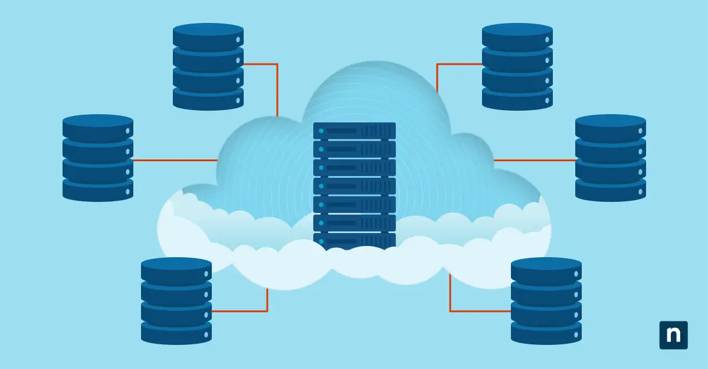

---
hide:
    - toc
---
## Using SAN for High Availability

---

### What is High Availability (HA)?
**High Availability (HA)** refers to the ability of an IT system to remain continuously operational, with minimal or no downtime, even in the event of hardware or software failures.  

In simple terms:  

- HA means your systems are **always up and running**.  
- Businesses often define HA with terms like **“five nines” availability (99.999%)**, which equals less than 5 minutes of downtime per year.  

For storage systems, downtime could mean lost access to critical data — which is unacceptable in industries like healthcare, banking, aviation, or e-commerce.

---

### How SAN Enables High Availability
SANs are designed with **redundancy and fault tolerance** at every layer. Here’s how they achieve HA:

1. **Multiple Storage Controllers**  

    - SAN storage arrays usually have at least two controllers.  
    - If one fails, the other takes over seamlessly (failover).  

1. **Dual Power Supplies**  
   
    - SAN devices and storage arrays use redundant power supplies connected to separate power circuits.  
    - This protects against power failures in one source.  

2. **Multipathing (Redundant Network Paths)**  
   
    - Servers connect to SAN storage through multiple physical network paths.  
    - If one path (cable, switch, or port) fails, the other continues to provide access.  

3. **RAID or Replication** 

    - RAID (Redundant Array of Independent Disks) protects against disk failures.  
    - Replication (synchronous or asynchronous) mirrors data across different arrays or even data centers.  

4. **Cluster Integration**  
   
    - SANs are often paired with server clusters.  
    - If one server fails, another server in the cluster can immediately take over, accessing the same SAN data.  

---

### Example: Hospital IT System
In a hospital, patient data must be accessible 24/7:  

- Doctors need real-time access to patient history and lab results.  
- A SAN setup with dual controllers, redundant paths, and replication ensures that even if one component (controller, switch, disk) fails, **data remains available instantly**.  
- Without HA in SAN, even a short outage could mean delays in life-critical care.  

---

!!! tip "Bonus/WOW Tip"
    Some enterprise SANs offer **geographically distributed HA** — also known as **metro clusters**:

    - Data is replicated in real-time across two different data centers in different locations.  
    - Even if an entire building or city loses power, the system automatically switches to the remote SAN without users noticing downtime.  
    - Example: Large banks often use metro clusters to ensure uninterrupted ATM and online transactions.  

---
