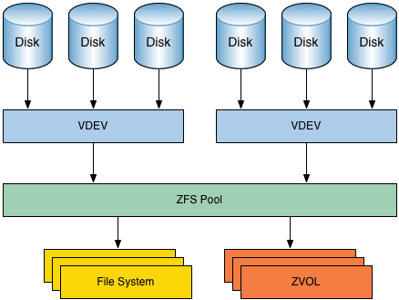

---
hide:
    - toc
---
## 1. ZFS Volume Configuration

---

### What is ZFS?
**ZFS (Zettabyte File System)** is both a **file system** and a **volume manager**, originally developed by Sun Microsystems and now widely adopted in enterprise and open-source storage systems (like FreeNAS/TrueNAS). Unlike traditional file systems (ext4, NTFS), ZFS integrates file system and volume management in a single layer.

---

### Key Features of ZFS
1. **Pooled Storage** 

    - Traditional systems use fixed volumes tied to specific disks.  
    - ZFS allows multiple physical disks to be grouped into a **storage pool**.  
    - From this pool, administrators can create flexible file systems or block devices as needed.  

1. **Snapshots and Clones**  

    - A **snapshot** is a read-only point-in-time copy of the file system.  
    - A **clone** is a writable copy of a snapshot, useful for testing and development.  

2. **Self-Healing**  
   
    - ZFS uses **checksums** to detect data corruption.  
    - If a bad block is detected, it automatically repairs it from redundant copies.  

3. **Advanced RAID (RAID-Z)** 
    
    - ZFS introduces RAID-Z, which is more reliable than traditional RAID-5.  
    - It avoids the “write hole problem” (risk of data loss during power failure).  

4. **Compression and Deduplication**  
   
    - Built-in compression saves storage space.  
    - Deduplication ensures identical data blocks are stored only once.  

---

### Example
An admin configures a **ZFS pool** on FreeNAS with 6 disks: 

- Pool created as **RAID-Z2** (tolerates up to 2 disk failures).  
- Snapshots taken daily for backups.  
- Deduplication enabled to optimize storage for virtual machine images.  

This setup ensures reliability, scalability, and efficient storage usage.

---

!!! tip "WOW Tip"
    ZFS is designed to scale up to **256 quadrillion zettabytes of storage**. While this is far beyond current hardware limits, it makes ZFS essentially **future-proof**.

---

## 2. IP-Based Storage Communication

---

### What is it?
In SANs, not all organizations can afford expensive Fibre Channel infrastructure. **IP-based storage communication** allows block-level storage traffic to run over standard Ethernet networks, making SAN technology accessible to smaller businesses.

---

### Theoretical Definition
Protocols like **iSCSI (Internet Small Computer Systems Interface)** encapsulate SCSI commands (used for disk operations) into IP packets. This allows servers to treat networked storage devices as if they were locally attached drives.

Other approaches include:  

- **FCoE (Fibre Channel over Ethernet):** Fibre Channel traffic encapsulated over Ethernet.  
- **NVMe over Fabrics (NVMe-oF):** Uses Ethernet, Fibre Channel, or InfiniBand to deliver ultra-fast access to NVMe drives.  

---

### Advantages of IP-Based SANs
1. **Cost-Effective** 
 
    - Uses existing Ethernet switches instead of Fibre Channel infrastructure.  

2. **Flexibility**  
   
    - Easy to extend SANs across geographic locations using standard IP networks.  

3. **Simpler Management**  
   
    - Network admins familiar with TCP/IP can manage iSCSI without learning Fibre Channel.  

4. **Integration with Virtualization**  

    - Popular hypervisors (VMware, Hyper-V, KVM) support iSCSI storage.  

---

!!! info "Example"
    - A small company uses a 10 Gbps Ethernet network with FreeNAS configured for iSCSI.  
    - Their servers connect to iSCSI targets (logical storage units).  
    - Virtual machines hosted on VMware ESXi use this shared iSCSI storage for VM disks.  
    This provides SAN-like benefits without high Fibre Channel costs.

---

!!! tip "WOW Tip"
    iSCSI SANs helped democratize enterprise storage. Many **cloud providers** started with iSCSI-based backends before upgrading to NVMe fabrics for scale.

---

## 3. Object Storage Services

---

### What is Object Storage?
Unlike SAN (block storage) or NAS (file storage), **Object Storage** treats data as discrete units called **objects**. Each object contains:  

- **Data** (the actual file, like an image or video).  
- **Metadata** (details about the file, like creation date, permissions).  
- **Unique Identifier** (an ID used to retrieve the object).  

---

### Theoretical Definition
Object storage is a **flat storage system** designed for massive scalability and unstructured data. Data is accessed via RESTful APIs (like **Amazon S3 API**) rather than traditional file system paths.  

---

### Advantages
1. **Massive Scalability**

    - Can store petabytes or even exabytes of data.  
    - No traditional file hierarchy, making it more efficient for large datasets.  

2. **Durability**

    - Objects are usually replicated across multiple servers or regions.  

3. **Accessibility via APIs**

    - Applications interact with object storage via URLs and APIs instead of mounting drives.  

4. **Cost-Effectiveness for Unstructured Data** 

    - Great for backups, archives, videos, images, logs, and cloud-native apps.  

---

### Examples
- **Amazon S3**: Used globally for cloud applications.  
- **Azure Blob Storage**: Microsoft’s object storage service.  
- **MinIO**: Open-source, S3-compatible object storage used for private clouds.  

---

!!! info "Real-World Use Case"
    **Netflix** uses Amazon S3 to store and deliver its massive video library. When you stream a show, the data is fetched as objects from distributed storage, ensuring high availability and low latency.

---

!!! tip "WOW Tip"
    Unlike block or file storage, object storage is **location-independent** — meaning your application doesn’t care where the data is physically stored. The unique object ID handles retrieval, making global-scale storage possible.

---

# Summary
- **ZFS** provides enterprise-grade reliability with advanced features like snapshots, RAID-Z, and self-healing.  
- **IP-based storage (iSCSI, FCoE, NVMe-oF)** brings SAN capabilities to Ethernet networks, making them cost-effective.  
- **Object Storage** is built for the cloud era, handling massive unstructured datasets via APIs.  

Together, these technologies complement SANs and modern data centers to provide **scalable, reliable, and flexible storage solutions**.

---
