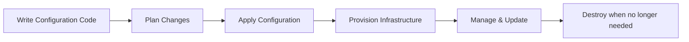

---
hide:
    - toc
---

# Infrastructure as Code (IaC)

## 🧠 Objectives

By the end of this session, students will:

* Understand what Infrastructure as Code (IaC) means.
* Differentiate between imperative and declarative approaches.
* Explore real-world benefits of IaC.
* Learn about popular IaC tools like Terraform, Ansible, Puppet, and Chef.

---

## 📖 What is Infrastructure as Code?

Infrastructure as Code (IaC) is the practice of managing and provisioning infrastructure (servers, networks, storage, databases) using **machine-readable configuration files** instead of manual processes or GUIs.

Think of IaC as **"treating infrastructure like software"**:

* Code defines what your servers should look like.
* Version control stores the configuration.
* Automation tools build the infrastructure consistently.

---

## ⚖️ Two Approaches in IaC

1. **Imperative (Procedural)**

      * Tells the system **how** to reach the desired state (step by step).
      * Example: Shell scripts, Puppet in procedural mode.

2. **Declarative (Desired State)**

      * Tells the system **what** the final state should look like.
      * Example: Terraform, Ansible.

!!! info "Analogy"
    **Imperative** = “Bake a cake step by step.”

    **Declarative** = “I want a chocolate cake.” (The system figures out steps).

---

## 🎯 Benefits of IaC

* **Consistency** → No configuration drift.
* **Speed** → Faster provisioning and scaling.
* **Versioning** → Track infra changes like source code.
* **Collaboration** → Teams can peer-review infra just like code.
* **Scalability** → Reuse configs across dev, test, prod.

---

## 🔧 Popular IaC Tools

* **Terraform (HashiCorp)** → Declarative, cloud-agnostic.
* **Ansible (Red Hat)** → Simple YAML playbooks, agentless.
* **Puppet** → Used in enterprise, can be both declarative/imperative.
* **Chef** → Ruby DSL, more developer-centric.

---

## 📊 IaC Lifecycle

---

## 🌍 Real-World Examples

* **Terraform on AWS**: Spin up EC2, VPCs, security groups with one command.
* **Ansible Playbooks**: Configure web servers with consistent packages.
* **Hybrid Infra**: Use Terraform to create infra and Ansible to configure apps.

---

