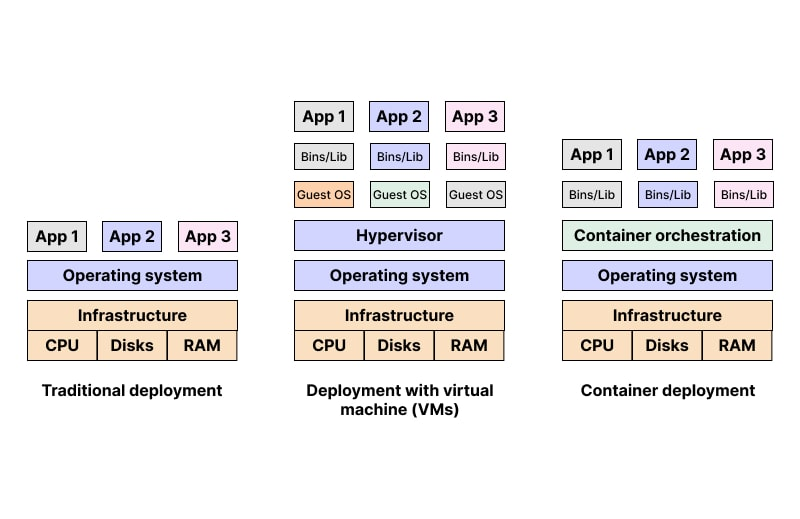
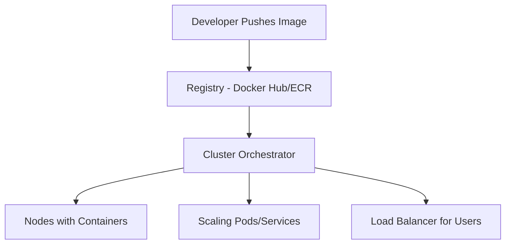

---
hide:
    - toc
---
# Container Orchestration (Kubernetes & Docker Swarm)

## 🧠 Objectives

By the end of this session, students will:

* Understand why container orchestration is necessary.
* Learn the fundamentals of Kubernetes and Docker Swarm.
* Compare Kubernetes and Swarm for enterprise vs. lightweight use cases.

---

## 📖 Why Orchestration?

Running one or two Docker containers manually is fine. But in production, apps might need **hundreds of containers** across multiple servers.

Problems without orchestration:

* How to start/stop containers on many nodes?
* How to handle failures?
* How to scale up and down?
* How to load balance?

**Container orchestration** solves all these challenges.


---

## 🚀 Kubernetes (K8s)

* Created by Google, managed by CNCF.
* Production-grade orchestration platform.

* **Key Concepts**:

    * **Pod**: Smallest unit, group of containers.
    * **Deployment**: Defines how pods run (replicas, updates).
    * **Service**: Exposes pods inside/outside cluster.
    * **Ingress**: Manages external access (like a reverse proxy).
    * **ConfigMap/Secret**: Store app configs and credentials.

**Features**:

* Self-healing → Restart failed containers automatically.
* Auto-scaling → Scale pods up/down based on load.
* Rolling updates → Zero downtime deployments.

---

## 🐳 Docker Swarm


**Docker’s native clustering and orchestration tool**

Docker Swarm is built directly into Docker, meaning if you already know Docker, you can quickly extend it to run containers across multiple machines. Instead of managing single hosts manually, Swarm groups them together into a **cluster** (called a *swarm*) that behaves like one big virtual Docker engine.

---

**Easier to set up than Kubernetes**

Kubernetes requires multiple components (API server, controller manager, etcd, kubelet) to work together, which makes setup complex. In contrast, Docker Swarm can be initialized with a **single command**:

```bash
docker swarm init
```

Adding worker nodes is just another simple command with a token. This makes Swarm much more approachable for beginners or small teams.

---

**Good for small to medium projects**

Swarm works best when you need orchestration but don’t want the overhead of Kubernetes. For example, a startup with a few microservices (say 10–20 containers) can use Swarm to manage scaling, load balancing, and service discovery without needing a large DevOps team. It’s lightweight, integrated with Docker CLI, and fits well into smaller environments.

---

**Lacks the depth of Kubernetes (fewer features)**

While Swarm is great for simplicity, it doesn’t offer the advanced ecosystem of Kubernetes. Features like:

* Auto-scaling based on metrics
* Advanced traffic routing (Ingress controllers, service meshes)
* Rich ecosystem of monitoring/logging integrations
* Declarative configuration through YAML manifests
are not as mature in Swarm. For enterprise-level applications with thousands of containers, Kubernetes is the industry standard.

---





---

## ⚖️ Kubernetes vs. Docker Swarm

| Feature             | Kubernetes | Docker Swarm |
| ------------------- | ---------- | ------------ |
| Setup Complexity    | High       | Low          |
| Scalability         | Very High  | Moderate     |
| Ecosystem/Community | Huge       | Small        |
| Enterprise Adoption | Standard   | Niche        |


---

## 📊 Orchestration Flow (Mermaid Diagram)



---

## 🌍 Real-World Example

* E-commerce site using Kubernetes:

  * Cart service in 5 pods.
  * Payment service in 3 pods.
  * Search service in 10 pods.
  * All automatically scaled and balanced by K8s.

---

