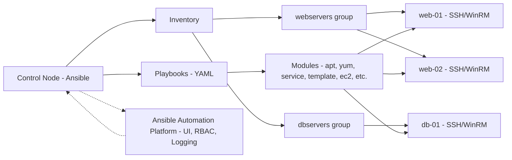
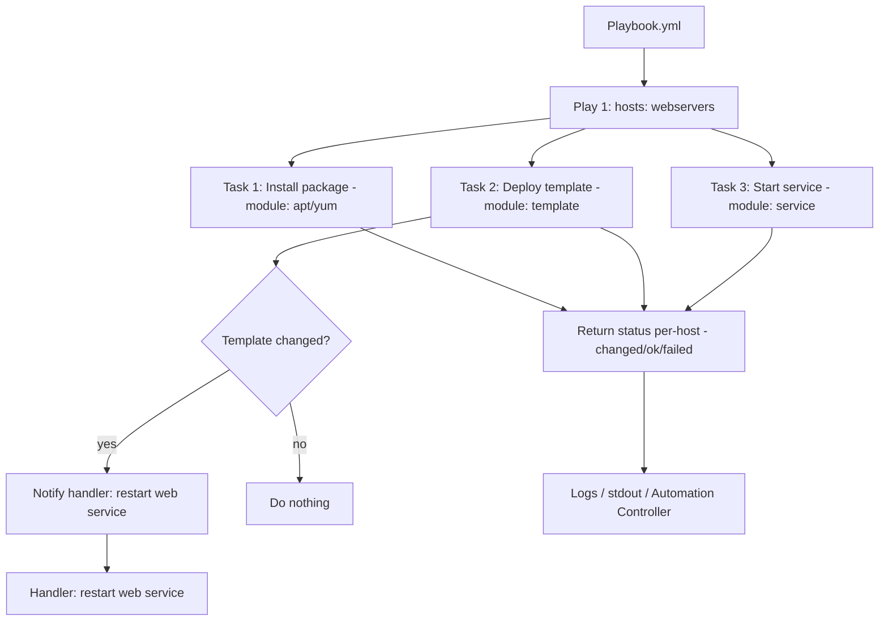

---
hide:
    - toc
---


# Ansible and Configuration Management

---

## 1. What is Ansible?

Ansible is an **open-source IT automation and configuration management tool**.

* It helps system administrators, DevOps engineers, and cloud teams **automate repetitive tasks** like installing software, configuring servers, deploying applications, and managing security patches.
* Instead of logging into 50 servers one by one, you write a simple script (called a **Playbook**) in YAML, and Ansible executes it on all servers at once using **SSH** (Linux) or **WinRM** (Windows).

📌 **Think of Ansible as a remote control for your entire infrastructure.**


---

## 2. Where is Ansible Used?

Organizations use Ansible in many domains:

* **Server Provisioning:** Setting up new Linux/Windows servers in AWS, Azure, or on-premise data centers.
* **Configuration Management:** Ensuring all servers have the same OS settings, firewall rules, users, and security patches.
* **Application Deployment:** Automating deployment of apps (e.g., deploying a web app to Kubernetes clusters).
* **Cloud Orchestration:** Managing AWS EC2, Azure VMs, GCP instances, Kubernetes pods.
* **Security Automation:** Enforcing compliance policies, applying OS hardening, rolling out security updates.
* **CI/CD Pipelines:** Integrating with Jenkins/GitHub Actions to deploy apps automatically after every code change.

---

## 3. Who Does Ansible Compete With?

Ansible operates in the **Configuration Management & Automation space**, competing with:

* **Puppet** – Agent-based, declarative, uses its own DSL (harder to learn).
* **Chef** – Agent-based, Ruby DSL, popular in early DevOps adoption.
* **SaltStack** – Uses an agent (Salt Minion), scales well, strong event-driven automation.
* **Terraform** – Infrastructure as Code (IaC) tool, focuses more on provisioning infra rather than config mgmt.

👉 **Ansible’s edge:** Unlike Puppet and Chef, **no agent is required**. It’s agentless, uses existing SSH/WinRM, and YAML (easy to read/write).

---

## 4. Benefits of Ansible

Why do so many companies love Ansible?

* **Agentless:** No extra software required on managed nodes. Only Python/SSH is needed.
* **Human-readable YAML:** Easy to learn for beginners and non-programmers.
* **Idempotency:** If a task is already applied (e.g., “Apache installed”), Ansible won’t repeat it unnecessarily.
* **Cross-platform:** Works on Linux, Windows, cloud, and network devices (Cisco, Juniper).
* **Scalable:** Can manage 10 or 10,000 nodes with the same simplicity.
* **Community + Enterprise Support:** Huge open-source community, plus enterprise-grade Red Hat support.
* **Integration:** Works with CI/CD, cloud APIs, security tools, Kubernetes.

📌 **In short: Simple, scalable, and safe automation.**

---

## 5. How Organizations Use the Paid “Ansible Automation Platform”

Red Hat offers a **commercial version** called **Ansible Automation Platform (AAP)**.
Enterprises adopt it for:

* **Centralized Control:** AAP includes **Ansible Tower (now Automation Controller)** → Web UI, RBAC (role-based access), logging, scheduling.
* **Collaboration:** Teams can run playbooks securely without needing direct SSH access.
* **Governance:** Tracks who ran which playbook, when, and on which servers (audit trails).
* **Automation Hub:** Private library of approved roles/playbooks for reuse.
* **Scalability:** Handles thousands of nodes with job distribution and high availability.
* **Compliance & Security:** Integrates with LDAP, SSO, enterprise-grade monitoring.

💡 **Example:** A bank uses AAP to ensure all servers always comply with PCI-DSS security standards. Instead of manual audits, they run Ansible playbooks daily to check and fix compliance.

---

## 6. Why Ansible is Easier than Competitors

* **No new language:** Puppet (DSL), Chef (Ruby), SaltStack (Jinja + YAML). Ansible → plain **YAML**.
* **Agentless:** No background services or daemons to maintain on target systems.
* **Quick adoption:** New engineers can learn YAML playbooks in a day or two.
* **Push-based model:** Immediate execution from control node (unlike Puppet/Chef which rely on agents pulling configs).
* **Consistency across hybrid environments:** Same playbook works for AWS, Azure, on-prem, or containers.

📌 That’s why many organizations migrating from Puppet/Chef have chosen Ansible as a **simpler, modern alternative**.

---

## 7. Core Components of Ansible

To understand Ansible deeply, you need to know its **building blocks**:

### (a) **Inventory**

* A file that defines **which machines** Ansible manages.
* Example:

  ```ini
  [webservers]
  192.168.1.10
  192.168.1.11
  ```
* Can be static (INI/YAML file) or dynamic (cloud inventory scripts that auto-fetch AWS EC2 instances).

---

### (b) **Modules**

* Small programs that Ansible runs on managed nodes to perform tasks (install package, start service, copy file).
* Example: `apt`, `yum`, `service`, `user`, `ec2_instance`.
* Thousands of built-in modules for Linux, Windows, cloud, and network devices.

---

### (c) **Tasks**

* A single action that Ansible performs (e.g., install Apache).
* Example:

  ```yaml
  - name: Install Apache
    apt:
      name: apache2
      state: present
  ```

---

### (d) **Plays**

* A **mapping between hosts and tasks**.
* Example: Run Apache installation tasks only on `webservers`.

---

### (e) **Playbooks**

* YAML files that contain one or more **Plays**.
* They describe **what should be done, on which servers, in what order**.
* Example: Install Apache + start service across all web servers.

---

### (f) **Handlers**

* Special tasks that run only when triggered. Useful for restarting services after a config change.
* Example:

  ```yaml
  handlers:
    - name: restart apache
      service:
        name: apache2
        state: restarted
  ```

---

### (g) **Variables**

* Used to customize playbooks for different environments.
* Example:

  ```yaml
  vars:
    http_port: 80
  ```

---

### (h) **Templates**

* Jinja2-based configuration files with variables.
* Example: Apache config template with `{{ http_port }}`.

---

### (i) **Roles**

* A **structured way** to organize playbooks for reusability.
* Example: A “webserver” role contains tasks, handlers, templates, and vars all bundled together.
* Encourages modular design → teams can share and reuse roles.

---

### (j) **Plugins**

* Extend Ansible with extra features (connection plugins, lookup plugins, filter plugins).

---

✅ Together, these components make Ansible **powerful yet simple**:

* **Inventory → Where to run**
* **Modules → What to run**
* **Playbooks/Plays → How to run it**
* **Roles → How to reuse it**

## Understanding Architecture

### High Level - (Control node → Inventory → Managed nodes)



#### Explanation:
Control Node runs Ansible and playbooks. Inventory describes hosts and groups. Playbooks use modules to perform actions on the managed nodes over SSH/WinRM. In enterprise, Ansible Automation Platform sits on top to provide UI, RBAC, scheduling, and audit trails.


### Playbook execution flow


#### Explanation:
A playbook contains one or more plays. Each play targets a host/group and defines tasks. Tasks call modules. If a task that modifies configuration triggers a handler, the handler runs at the end of the play. Each host returns results (ok/changed/failed) which go to logs or the Automation Controller.

---

## 8. Setting Up Ansible Environment

**Objectives:**

* Install Ansible on Linux/Mac/Windows WSL.
* Verify installation and configure first control node.

**Key Concepts:**

* **Control Node:** Machine where Ansible is installed.
* **Managed Nodes:** Target systems (Linux/Windows).
* **Requirements:** Python 3, SSH access, sudo privileges.

**Setup Overview:**

=== "On Linux (Ubuntu)"

    ```bash
    sudo apt update
    sudo apt install ansible -y
    ansible --version
    ```

=== "On CentOS/RHEL"

    ```bash
    sudo yum install epel-release -y
    sudo yum install ansible -y
    ```

=== "On macOS (Homebrew)"

    ```bash
    brew install ansible
    ```
 
=== "On Windows"
    Use **WSL2** or Ansible via **Docker**.


---

## 9. Ansible Playbooks and YAML Basics

**Objectives:**

* Learn YAML syntax used in Ansible.
* Write your first playbook.

**Key Concepts:**

* **Playbooks:** Declarative scripts written in YAML describing desired system states.
* **YAML Rules:**

  * Indentation with spaces (no tabs).
  * Key-value pairs.
  * Lists start with `-`.

**Example Playbook:**

```yaml
---
- name: Install Apache on webservers
  hosts: webservers
  become: yes
  tasks:
    - name: Install Apache package
      apt:
        name: apache2
        state: present
```


---

## 10. Managing Ansible Inventory

**Objectives:**

* Understand inventory formats and groups.
* Configure static and dynamic inventories.

**Key Concepts:**

* **Inventory:** File listing managed nodes.
* **Static Inventory (INI format):**

  ```ini
  [webservers]
  server1 ansible_host=192.168.1.10 ansible_user=ubuntu
  server2 ansible_host=192.168.1.11 ansible_user=ubuntu
  ```
* **Dynamic Inventory:** Pulls hosts from cloud providers (AWS EC2, Azure).
* **Ansible Config File (`ansible.cfg`):** Defines inventory path, defaults, SSH settings.


---

## 11. Ansible Roles and Reusability

**Objectives:**

* Learn role-based structure for scalable automation.
* Explore Galaxy for reusable roles.

**Key Concepts:**

* **Role:** Predefined structure for tasks, variables, templates, files. Promotes **modularity**.
* **Role Directory Layout:**

  ```
  roles/
    webserver/
      tasks/main.yml
      handlers/main.yml
      templates/
      vars/main.yml
  ```
* **Ansible Galaxy:** Public repository of community roles.

  ```bash
  ansible-galaxy install geerlingguy.apache
  ```
* **Best Practices:**

  * Use roles for repeatable patterns (e.g., LAMP stack).
  * Version-control roles in GitHub.
  * Tag tasks for selective execution.

---